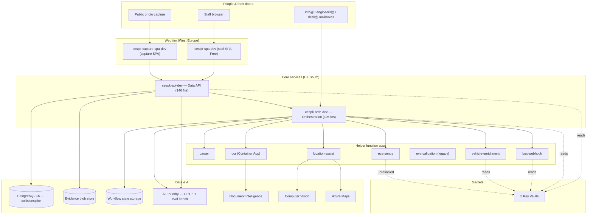

# Complete Azure & Microsoft cloud inventory — 2026-07-17

This is a full, read-only inventory of everything under the Collision Engineers Microsoft tenant and its
Azure subscription: every resource, application, identity, key, licence and cost that could be enumerated.
It was produced by querying Azure and Microsoft Graph directly on 2026-07-17; repository documentation was
**not** trusted as the source of truth and is used only for the drift check in Appendix A.

- **Tenant:** Collision Engineers (`collisionengineers.co.uk`, id `858cf5b3-aa0a-47a6-9b40-4851fd0afa94`)
- **Subscription:** "Azure subscription 1" (`e6076573-23a5-46a8-acef-7e22d264e5db`), state Enabled
- **Collected by:** `digital@collisionengineers.co.uk` (delegated user sign-in), Azure CLI 2.88.0
- **Method:** read-only. No resource was changed. **No secret value was ever retrieved** — only names,
  classifications and expiry dates. See section 2 for the guarantees and what could not be read.

---

## 1. Executive summary

1. **One tenant, one subscription, one main region.** Almost everything runs in the single resource group
   `rg-collisionspike-dev` in **UK South**. There are **56 Azure resources** across 17 types, plus the
   Microsoft 365 directory and two Azure DevOps organisations.
2. **The subscription is now Pay-As-You-Go, not a Free Trial.** The live offer is `PayAsYouGo_2014-09-01`
   with the spending limit **off**. The operator's long-standing "upgrade before the trial expires"
   task is effectively **done** — the repository snapshot that still says "Azure Free Trial" is stale.
3. **The estate is the CollisionSpike case-handling system.** A staff web app, a large REST Data API
   (**146 functions**), a workflow engine (**105 functions**), and seven smaller function apps for
   parsing, vehicle enrichment, EVA, OCR, Box archiving and location help. All run on serverless
   (Flex Consumption / Container Apps), all HTTPS-only on TLS 1.2, each with its own managed identity.
4. **The data lives in three places:** a PostgreSQL 16 flexible server (`collisionspike` database), an
   evidence blob store, and ten storage accounts (mostly per-app working storage plus the Durable
   Functions workflow state).
5. **There is a real AI footprint.** An Azure AI Foundry resource hosts **GPT-5**, a text-embedding
   model, and a nine-model evaluation bench (GPT-5 mini/nano variants, Phi-4, DeepSeek, Llama, Cohere).
   Document Intelligence and Computer Vision accounts back OCR. **AI is the single biggest cost driver.**
6. **People:** 17 directory accounts (about 13 real staff plus shared/functional mailboxes), governed by
   Microsoft 365 Business Basic/Premium licences and one Microsoft 365 Copilot seat.
7. **Secrets are handled well, with two exceptions.** Application secrets live in five Key Vaults and are
   surfaced to apps as Key Vault references — no secret sits in plain app configuration. **But** the
   CarClaims Website app-registration secret **expired on 2026-04-29**, and the EVA Key Vault is **empty**
   so the EVA app's two credential references are unresolved.
8. **Monitoring is thin.** Application Insights and Log Analytics are collecting telemetry, but there are
   **no alert rules of any kind** and the one action group has **no email recipient** — nothing would page
   anyone if a component failed.
9. **Security guardrails are minimal.** No Azure Policy, no resource locks, no Microsoft Defender for Cloud,
   no Conditional Access that this account can see, and any user may register apps and invite guests. The
   tenant has no Entra ID Premium (P1/P2), so several security reports could not be read at all.
10. **Cost is low: about £50 month-to-date** (£29 of it AI). Top concerns for follow-up: the empty EVA
    vault, the absence of alerting, and an old EVA-validation app that is still running despite being
    marked for retirement. (The expired CarClaims secret is **out of scope — CarClaims is off-limits per a
    hard repository rule, AGENTS.md → Live-system safety; never touch it.**)

---

## 2. How this inventory was made

**Read-only guarantee.** Every call was a list/show/GET (or a Cost Management *query*, which only reads).
A hard block-list in the collection scripts refused any command that returns credential material —
storage keys, Key Vault secret values, function keys, publishing profiles, connection strings. Application
settings do return values, so those were reduced **in memory, before saving**, to just the setting name and
a classification (points at Key Vault / has a value / empty). App Insights and Container App objects were
run through a redaction pass that replaces any embedded connection string or key with a placeholder. A
final sweep scanned all 510 saved datasets for secret-shaped text and passed clean.

**Tooling.** Azure CLI 2.88.0 with the `resource-graph` and `application-insights` extensions. Azure
Resource Graph gave the authoritative resource list; `az rest` was used against the Azure Resource Manager
and Microsoft Graph APIs where no CLI command exists. There were no Azure MCP tools in this session and no
extra tools were installed. Microsoft Graph was reached with the signed-in user's delegated token.

**Provenance.** Each dataset was saved with the exact command and a UTC timestamp (Appendix B). Counts in
this report come from those saved datasets, re-verified live where a value was material.

**What could not be read** (full list in Appendix C):

| Area | Why it could not be read |
| --- | --- |
| Sign-in activity, MFA registration, sign-in audit logs | Tenant has no Entra ID Premium (P1/P2) licence |
| Conditional Access policies, named locations, auth-methods policy, security-defaults state | This account lacks a security-reader directory role |
| Microsoft Defender for Cloud posture | The `Microsoft.Security` provider is not registered on the subscription |
| Key Vault **keys and certificates** | The inventory account has the Secrets role only, not the crypto/certificate role |
| Management groups, reservations, savings plans | No authorisation at those scopes |
| Mail-intake webhook subscriptions | Microsoft Graph only returns webhooks owned by the calling app; the mail app's own subscriptions are invisible to a user token (cross-evidenced in section 5) |
| Microsoft 365 service health / message centre, Intune | Forbidden / not applicable to this tenant |

None of these were skipped silently — each appears as an explicit limitation.

---

## 3. Tenant & subscription

**The directory.** "Collision Engineers" was created on 2022-11-17, country GB, and is **cloud-only** (no
on-premises synchronisation). It owns three verified domains:

| Domain | Role |
| --- | --- |
| `collisionengineers.co.uk` | Primary / default |
| `carclaims.co.uk` | Secondary (the Car Claims brand) |
| `collisionengineers.onmicrosoft.com` | The built-in Microsoft routing domain |

**The subscription.** A single subscription, **Pay-As-You-Go** (`PayAsYouGo_2014-09-01`), spending limit
**off**, authorisation "RoleBased", billed under a **Microsoft Customer Agreement** (individual account,
holder "Alex Mercer", status Active). There is only one subscription and one tenant — no other Azure
directories, no Azure AD B2C tenants.

**Microsoft 365 licences (what the business is paying Microsoft for):**

| Plan | Purchased | In use |
| --- | --- | --- |
| Microsoft 365 Business Premium | 6 | 6 |
| Microsoft 365 Business Basic | 6 | 6 |
| Exchange Online Archiving add-on | 5 | 5 |
| Microsoft 365 Copilot | 1 | 1 |
| Free self-service Microsoft trials (auto-enrolled: workflow automation + low-code trials) | — | 1–6 |

Every paid seat is consumed — there is no spare Business licence. The free self-service plans are
auto-provisioned into every Microsoft 365 tenant, carry a handful of seats, and are not a paid or material
cost here.

---

## 4. People & access

**17 accounts.** Roughly thirteen are real people; the rest are shared or functional mailboxes.

| Account | Name | Enabled | Licences | Notes |
| --- | --- | --- | --- | --- |
| `admin@…onmicrosoft.com` | Rob Tyson | Yes | 1 | **Global Administrator** (the top-level admin) |
| `digital@collisionengineers.co.uk` | Collision Engineers | Yes | 5 | The engine-room / operator account (see roles below) |
| `andrew@` | Andrew Patterson | Yes | 3 | |
| `ar@` | AR | Yes | 3 | |
| `desk@` | Desk | Yes | 3 | Mail-intake mailbox |
| `engineers@` | Engineers | Yes | 2 | Mail-intake mailbox |
| `info@` | Info | Yes | 2 | Mail-intake mailbox |
| `ben@` | Ben | Yes | 2 | |
| `neil@`, `patrick@`, `jake@`, `ed@`, `admin` | Neil, Patrick Rooney, Jake, Ed | Yes | 1 | |
| `info@carclaims.co.uk` | Car Claims | Yes | 1 | The Car Claims brand mailbox |
| `accounts@`, `eva@`, `newbusiness@` | — | Yes | 0 | Unlicensed shared/functional mailboxes |
| `sahil@` | Sahil Najak | Yes | 0 | Unlicensed |

**Groups.** Two Microsoft 365 groups: "Collision Engineers" (14 members — essentially everyone) and
"All Company" (1 member). There are no security groups used for Azure access.

**Directory (admin) roles.**

| Role | Held by |
| --- | --- |
| Global Administrator | `admin@…onmicrosoft.com` (Rob Tyson) |
| Application Administrator | `digital@` |
| Cloud Application Administrator | `digital@` |
| Exchange Administrator | `digital@` |
| Low-code platform administrator | `digital@` |
| License Administrator | `digital@` |

The most dangerous roles — Privileged Role Administrator, User Administrator, Privileged Authentication
Administrator, Global Reader — are **empty**. Administrative power is concentrated in two accounts.

**Devices.** 18 registered/joined devices in the directory.

**Posture note.** The directory's authorization policy is permissive: **any user may register applications**,
**any user may create security groups**, and **guest invitations are allowed from everyone**. Whether
"security defaults" (baseline MFA) is switched on could not be read with this account, and there is no
visible Conditional Access — so multi-factor enforcement should be confirmed in the portal.

---

## 5. Applications & identities (Entra ID)

### App registrations (8)

These are the identities the software uses to sign in and to be signed in to.

| Application | Purpose | Credential status |
| --- | --- | --- |
| **CollisionSpike API** | The Data API. Defines the app roles `CollisionSpike.User`, `CollisionSpike.Superuser`, `CollisionSpike.Engineer` | No secret — uses managed identity |
| **CollisionSpike SPA** | The staff web app front-end; signs users in and calls the API | No secret — public client |
| **CollisionSpike MCP Client** | Model-Context-Protocol client (created 2026-07-10); calls the API | No secret |
| **CollisionSpike Graph Intake** | Reads the three intake mailboxes for mail intake | Secret **valid to 2027-06-26** (Key-Vault-managed) |
| **CarClaims Website** | The `carclaims.co.uk` website; sends email via Microsoft Graph | ⚠️ Secret **expired 2026-04-29** (~11 weeks ago) |
| **P2P Server** | Unknown purpose (created 2025-06-18); no credential, no API permissions recorded | No secret |
| **digital-3339-resource … AgentIdentityBlueprint** ×2 | Entra Agent-ID blueprints tied to the AI Foundry project (created 2026-07-01) | No secret |

Only two app registrations hold their own secret. **CollisionSpike Graph Intake** — the app that reads
mail — is healthy until mid-2027. **CarClaims Website** is the one to act on: its secret has already
expired, and the app is consented to send and read mail through Microsoft Graph.

The mail-intake app has **no tenant-wide Microsoft Graph application role visible**, consistent with the
documented Exchange-scoped boundary. Its live webhook subscriptions cannot be listed from a user token
(Graph only returns the caller's own), so the intake app registration is the standing evidence that mail
intake is wired.

### Enterprise apps / third-party access

There are **369 service principals**; 340 are Microsoft first-party. Of the 29 that belong to the tenant
or third parties, the CollisionSpike managed identities and Foundry agent identities are expected. The
**external/SaaS connectors that have been granted mailbox or file access** are worth knowing about:

| Connector | Access granted (delegated) | Consented by |
| --- | --- | --- |
| **ChatGPT** (OpenAI) | `Mail.Read`, `User.Read` for all users; one user additionally granted full mailbox read/write/send | Rob Tyson + org-wide |
| **M365 MCP Server for Claude** | Broad per-user: mail read, chat, files, calendars, online-meeting transcripts | Per user |
| **M365 MCP Client for Claude** | Sign-in / User.Read | Org-wide |
| **Pabbly Connect** | Files and SharePoint read/write for one user | Andrew Patterson |
| **Apple Internet Accounts** | Exchange ActiveSync (mail/calendar on Apple devices) | AR + Car Claims |
| **O365 LinkedIn Connection** | LinkedIn profile enrichment in Outlook | Microsoft feature |

Who holds the CollisionSpike application roles (the app's own permission model):

| App role | Granted to |
| --- | --- |
| `CollisionSpike.User` | Desk, Engineers, Info mailboxes |
| `CollisionSpike.Superuser` | Collision Engineers (`digital@`) |
| `CollisionSpike.Engineer` | Defined, granted to nobody |

There are 18 delegated OAuth consent grants in total; the notable ones are the mail/file scopes above.

---

## 6. The application estate

All 56 resources reconcile exactly to the sections below (proof in Appendix A). Everything lives in five
resource groups, but only `rg-collisionspike-dev` holds application resources; the other four are
Azure-managed billing/infrastructure groups (the OCR container environment, the default Log Analytics
group, and two Azure DevOps billing groups).

### 6.1 Web & function apps

There are **eight App Service (Flex Consumption) plans** and **nine function-hosting sites**, all Linux,
all Functions runtime v4, all HTTPS-only on TLS 1.2, each with a system-assigned managed identity.

| App | What it is | Functions | Notes |
| --- | --- | --- | --- |
| **cespk-api-dev** | The REST **Data API** the web app calls | **146** | Sign-in protection (Easy Auth) **on**; 57 settings (7 Key-Vault-backed) |
| **cespk-orch-dev** | The **workflow engine** (Durable Functions) | **105** | Drives intake, triage, archiving, EVA, chasers |
| **cespkbox-fn-v76a47** | **Box archive** webhook & file operations | 16 | |
| **cespike-parser-dev-…** | **Document/email parser** | 5 | classify, explode `.eml`, extract images, fingerprint, parse |
| **cespkocr-fn-dev-glju3v** | **OCR** (plate & scanned PDF) — runs as a **Container App** from image `ce-ocr:latest` | 2 | The only containerised component; system + user-assigned identity |
| **cespkenrich-fn-gi62sd** | **Vehicle enrichment** (DVSA/DVLA lookups) | 1 | `dvsa_mot_enrich` |
| **cespkeva-fn-ufa3ci** | **EVA Sentry** integration | 1 | `eva_instruction_inspection` |
| **cespkloc-fn-a7tzj2** | **Location assistance** | 1 | `location-suggest` |
| **cespkeval-fn-6c6fxd** | **EVA validation** (older) | 1 | ⚠️ **Still running** though marked for retirement — see section 11 |

The Data API's function names read as the whole product surface — cases, queues, evidence, inbound email,
Box archiving, capture sessions, AI suggestions, provider API keys, vehicle lookup, MCP server, and more.
The orchestration app's names are the background machinery — intake orchestrators, triage, Box archive
monitors, EVA report polling, chasers, retroactive-case building, and the Microsoft Graph mail
subscription renewal.

**Posture note:** the SCM/Kudu deployment endpoint still allows basic authentication on six of the smaller
function apps (parser, box, enrich, eva, eval, loc). The two large apps and the API have it off.

### 6.2 Web front-ends (Static Web Apps)

| App | Purpose | Tier | Backend |
| --- | --- | --- | --- |
| **cespk-spa-dev** | The **staff web app** | Free | No linked backend (calls the API by configuration) |
| **cespk-capture-spa-dev** | The **public photo-capture** front-end | Standard | Linked to `cespk-api-dev` |

Both are in West Europe. Neither has a custom domain configured; they use their `*.azurestaticapps.net`
default host names.

### 6.3 Database

**`cespk-pg-dev`** — Azure Database for PostgreSQL **Flexible Server, version 16**, Burstable `Standard_B1ms`,
32 GB storage. High availability **disabled**, backups retained **7 days**, geo-redundant backup **off**.
Public network access **enabled**, with a single firewall rule ("Allow Azure Services"). Entra
administrator is `digital@`. The application database is `collisionspike`; the rest are system databases.

### 6.4 Storage (10 accounts)

All ten are Standard locally-redundant (LRS), StorageV2, UK South, HTTPS-only, TLS 1.2. Nine disable both
blob public access and shared-key access, so they can only be reached with a managed identity — a good
posture. The exceptions and the interesting ones:

- **cespkevidstdev01** — the **evidence blob store** (container `evidence`). This is the one account that
  **still allows shared-key (account-key) access**.
- **cespkorchstdev01** — the **workflow engine's state**: 5 containers, 11 queues (intake, outlook-move,
  sent-items, evidence-backfill, plus Durable Functions control/work-item/poison queues) and 3 Durable
  Functions tables (History, Instances, Partitions).
- The remaining eight are per-function-app working storage (`app-package`, `azure-webjobs-hosts`,
  `azure-webjobs-secrets`).

### 6.5 AI services

| Resource | What it is | Tier |
| --- | --- | --- |
| **digital-3339-resource** | **Azure AI Foundry** — the AI brain, with an evaluation bench | S0 |
| **cespkdocintel-dev** | **Document Intelligence** (form/PDF extraction) | F0 (free) |
| **cespkvision-dev** | **Computer Vision** (image analysis) | F0 (free) |
| **cespkmaps-dev** | **Azure Maps** (address/location) | G2 Standard |

The Foundry resource hosts **11 model deployments**: production `gpt-5` and `text-embedding-3-large`, plus a
nine-model evaluation set (`gpt-5-nano`, `gpt-5.4-nano`, `gpt-5-mini`, `gpt-5.4-mini`, `Phi-4-mini`,
`DeepSeek-V4-Flash`, `Llama-4-Maverick`, `Llama-3.3-70B`, `Cohere-command-a`) each at capacity 1 — a bench
for comparing models rather than serving traffic. There is also a Foundry **project** (`digital-3339`) and
two Entra **Agent-ID blueprints** tied to it.

### 6.6 Containers

- **cespkocracraeee76** — Azure Container Registry (Basic, admin user off). It holds **two** images:
  `ce-ocr` (the OCR service) and **`valuationbot-mcp`** — a second image not reflected in the repository's
  environment snapshot and worth noting given the "valuation lookup" capability is meant to be dormant.
- **cespkocr-env-dev** — the Container Apps environment that hosts the OCR container.
- A user-assigned identity **cespkocr-acrpull-id** lets the OCR container pull from the registry.

### 6.7 Resource map

---

## 7. Keys & credential posture (metadata only)

**Application configuration is clean.** Across the six apps that use them, every sensitive setting is a
**Key Vault reference**, not a literal value — passwords, function keys, client secrets and API keys all
resolve to one of the five vaults. No secret value sits in app configuration.

**The five Key Vaults** (all use the modern RBAC permission model; all have soft-delete on):

| Vault | Secrets held | Purge protection |
| --- | --- | --- |
| **cespk-pg-kv-dev** (shared) | 11 — PostgreSQL passwords, function keys, Graph client secret, Maps/Vision keys, capture token | Off |
| **cespkboxkvv76a47** | 4 — Box client secret, config, two webhook keys | Off |
| **cespkenrichkvgi62sd** | 4 — DVSA/DVLA client id, secret, API keys | Off |
| **cespklockva7tzj2** | 2 — Maps key, Vision key | **On** |
| **cespkevakvufa3ci** | **0 — empty** | Off |

**Two credential problems stand out:**

1. **The EVA vault is empty.** `cespkeva-fn-ufa3ci` reads `EVA_CLIENT_ID` and `EVA_CLIENT_SECRET` as Key
   Vault references pointing at `cespkevakvufa3ci/eva-client-id` and `…/eva-client-secret`, but that vault
   holds no secrets — **both references are unresolved**. This is consistent with EVA submission being
   deliberately dormant, but it means the EVA credentials are simply not present. Every other app's Key
   Vault references were verified to resolve to a secret that exists.
2. **The CarClaims Website secret expired on 2026-04-29** (section 5).

**Other posture facts:**

- **No Key Vault secret has an expiry date set** — there is no rotation deadline on any of them.
- The **evidence storage account** allows shared-key access; the other nine storage accounts are
  managed-identity-only.
- **Managed identities are used well.** Each function app authenticates to storage, Key Vault and the AI
  services with its own system-assigned identity, scoped to just the resources it needs (section 9).
- Key Vault **keys and certificates** could not be listed (the inventory account has the Secrets role
  only), so certificate expiry inside the vaults is not covered here.

---

## 8. Monitoring & alerting

Telemetry **is** being collected:

- **5 Application Insights** instances (parser, Data API, orchestration, OCR, and the Foundry resource),
  all with 90-day retention.
- **4 Log Analytics workspaces** (parser, OCR, Foundry, and the subscription default), all 30-day, standard
  pay-per-GB.
- **24 resource-level diagnostic settings** feed logs into those workspaces.

But **nothing is watching the telemetry**:

- **0 metric alerts, 0 log/query alerts, 0 activity-log alerts, 0 smart-detector rules, 0 availability
  web tests, 0 autoscale rules.**
- The only action group, "Application Insights Smart Detection", has **no email recipient**, so even
  automatic anomaly detection has nowhere to send a notification.

In practice, if a function app started failing, no alert would fire and no one would be paged. This is the
single biggest operational gap in the estate.

---

## 9. Governance & security

**Who can do what (Azure RBAC — 34 assignments).** The pattern is genuinely least-privilege for the
software:

- `digital@` is **Owner** of the subscription (and holds Key Vault Secrets Officer, Foundry User, and
  storage data roles for hands-on work).
- Each function app's **managed identity** has only the roles it needs — for example, the orchestration
  identity has Storage Blob/Queue/Table Data roles on the workflow storage account, "Cognitive Services
  OpenAI User" on the Foundry resource, and "Key Vault Secrets User" on the shared vault, and nothing
  else. The Box, enrichment, EVA, location and OCR identities are each scoped to their own storage
  account, vault and services.

**Guardrails are largely absent:**

| Control | State |
| --- | --- |
| Azure Policy assignments | **None** |
| Custom RBAC roles | **None** |
| Resource locks | **None** (nothing is protected from accidental deletion) |
| Microsoft Defender for Cloud | **Not enabled** (provider not registered) |
| Security contacts | **None** |
| Microsoft Sentinel | **None** |
| Private networking (VNets, private endpoints, NSGs) | **None** — every service is on its public endpoint |
| Azure DNS zones | **None** — the domains are hosted with an external DNS provider |

**Azure Advisor** raised **51 recommendations, all in the "High Availability" category** — there are no
separate security or performance recommendations surfaced. The themes all reflect the deliberate
single-region, dev-tier design: move App Service plans off Flex Consumption to get a ≥2 instance floor,
turn on zone redundancy and soft-delete for storage, and give PostgreSQL geo-redundant backup, zone-
redundant HA and a read replica.

**Recent administrative activity (last 14 days — 987 events).** Almost all by `digital@` (809 events).
The busiest operations were listing site/cognitive keys (used by deploy scripts), **repeated PostgreSQL
firewall-rule rewrites (159 deletions and 134 writes)**, App Service config writes, and transient Container
Instance create/delete cycles. The firewall churn suggests an automated process keeps rewriting the
database firewall — worth understanding.

---

## 10. Cost

Because the subscription is Pay-As-You-Go under a Microsoft Customer Agreement, cost data **is** available
(unlike a Free Trial). **Month-to-date spend is £50.71** (as of 2026-07-17):

| Service | Month-to-date (GBP) | Share |
| --- | --- | --- |
| **Azure AI Foundry models** | £29.45 | 58% |
| **Functions** | £14.74 | 29% |
| Storage | £4.38 | 9% |
| Container Registry | £2.10 | 4% |
| App Service | £0.03 | — |
| Container Instances | £0.01 | — |
| Key Vault, PostgreSQL, Log Analytics, Bandwidth | £0.00 | — |

AI is the dominant cost, followed by the serverless functions. Everything else is negligible at this dev
scale. The "last month" and "forecast" cost queries failed on a query-shape technicality, not a permission
issue, so month-to-date is the reliable figure; a fuller monthly history is available in the portal's Cost
Management blade.

---

## 11. Observations

These are factual observations from the inventory. No remediation was performed; nothing here changes the
system.

1. **[Security — act] The CarClaims Website app secret expired on 2026-04-29.** The app is consented to
   read and send mail via Microsoft Graph; anything relying on that credential has been broken for ~11
   weeks or is running on an undocumented fallback.
   > **DO NOT ACT — CarClaims is off-limits.** Superseded by a hard repository rule (AGENTS.md →
   > Live-system safety): CarClaims (the app registration, its secret, `carclaims.co.uk`, the mailbox, the
   > brand) is **never touched** by agent work — no rotate, revoke, retire, or any mutation, and no ticket
   > or remediation. This "[Security — act]" line is recorded for awareness only; the operator manages
   > CarClaims themselves. Leave it entirely alone.
2. **[Correctness] The EVA Key Vault (`cespkevakvufa3ci`) is empty**, leaving the EVA function app's
   `EVA_CLIENT_ID` / `EVA_CLIENT_SECRET` Key Vault references unresolved. Aligns with EVA submission being
   dormant, but the credentials are absent rather than merely gated.
3. **[Reliability] There is no alerting.** No metric/log/activity alerts, no availability tests, and the
   sole action group has no recipient. Failures would be silent.
4. **[Drift] The legacy EVA-validation app (`cespkeval-fn-6c6fxd`) is still running** with one function,
   despite the repository snapshot recording it as removed after a no-use audit. Its storage account
   (`cespkevalst6c6fxd`) is also still present. The documented "live retirement" is not done.
5. **[Drift] The subscription is Pay-As-You-Go, not a Free Trial** — the operator's upgrade watch-item is
   effectively complete and the repository snapshot is stale (Appendix A).
6. **[Note] An undocumented container image `valuationbot-mcp` sits in the registry**, and a `P2P Server`
   app registration exists with no recorded purpose. Both are worth confirming against intent given the
   "valuation lookup" capability is meant to be dormant.
7. **[Function counts have grown]** The Data API is now 146 functions (was 144) and orchestration is 105
   (was 101) — normal drift, noted for the record.
8. **[Security posture] Any user can register apps and invite guests**, MFA/Conditional-Access enforcement
   is not visible to this account, and there is no Entra ID Premium — so identity-protection features are
   unavailable and should be reviewed in the portal.
9. **[Resilience] Nothing is locked, backed by zone redundancy, or geo-redundant**, and the evidence
   storage account still permits shared-key access. Consistent with a dev environment; relevant if this
   estate is treated as production.

---

## Appendix A — Completeness cross-check

Every resource type reported by Azure Resource Graph is accounted for in a section above.

| Resource type | Count | Covered in |
| --- | --- | --- |
| microsoft.storage/storageAccounts | 10 | 6.4 |
| microsoft.web/sites | 9 | 6.1 |
| microsoft.web/serverfarms (App Service plans) | 8 | 6.1 |
| microsoft.insights/components (App Insights) | 5 | 8 |
| microsoft.keyvault/vaults | 5 | 7 |
| microsoft.operationalinsights/workspaces | 4 | 8 |
| microsoft.cognitiveservices/accounts | 3 | 6.5 |
| microsoft.web/staticsites | 2 | 6.2 |
| microsoft.visualstudio/account (Azure DevOps) | 2 | Appendix D |
| microsoft.dbforpostgresql/flexibleservers | 1 | 6.3 |
| microsoft.app/containerapps | 1 | 6.1 / 6.6 |
| microsoft.app/managedenvironments | 1 | 6.6 |
| microsoft.containerregistry/registries | 1 | 6.6 |
| microsoft.maps/accounts | 1 | 6.5 |
| microsoft.managedidentity/userassignedidentities | 1 | 6.6 |
| microsoft.insights/actiongroups | 1 | 8 |
| microsoft.cognitiveservices/accounts/projects | 1 | 6.5 |
| **Total** | **56** | — |

**Drift against the repository snapshot `LIVE_FACTS.json` (last verified 2026-07-16).** Live state wins;
all eleven documented deployables were found running.

| Item | Repository said | Live reality |
| --- | --- | --- |
| Subscription tier | Azure Free Trial | **Pay-As-You-Go** (upgraded) |
| cespk-api-dev functions | 144 | **146** |
| cespk-orch-dev functions | 101 | **105** |
| EVA validation app | Removed / no source | **Still running** (1 function) |
| AI Foundry, Document Intelligence, Vision, Maps, ACR, capture SPA, MCP client app, 2 DevOps orgs | Not itemised | **Present** (documented here) |

**Reconciliation (TKT-257 / TKT-273).** The `cespk-api-dev` "146" above is the raw endpoint count captured
on 2026-07-17; it over-counts host/admin endpoints. The reconciled count of **registered application
functions is 144**, which is the governed value in `LIVE_FACTS.json` and in the machine-readable evidence
snapshot [`live-facts.evidence.json`](./live-facts.evidence.json). The `cespk-orch-dev` reading later rose
to 105 after the 2026-07-17 `d6ee70de` deploy. The parser host runs five functions (`LIVE_FACTS.json` now
records 5, not the earlier 4). The offline `check:live-facts` gate keeps the registry and this snapshot in
parity.

## Appendix B — Dataset provenance

The collection produced **510 datasets**, each saved with its exact command and UTC timestamp in a run
manifest. The four collection scripts and the manifest schema are committed under
`scripts/maintenance/cloud-inventory/`. Collection ran on 2026-07-17 between roughly 09:14 and 09:42 UTC.
Raw snapshot files are intentionally **not** committed (they are regenerable and voluminous); the manifest
and this report carry the provenance.

## Appendix C — Limitations & degradations

| Dataset / area | Result | Meaning |
| --- | --- | --- |
| Entra sign-in activity, MFA registration, sign-in audit | Forbidden — no premium tenant | Needs Entra ID P1/P2 |
| Conditional Access, named locations, auth-methods, security-defaults state | Forbidden | Needs a security-reader role; verify MFA in portal |
| Microsoft Defender for Cloud (pricing, autoprovisioning, secure score) | Not registered / empty | Defender for Cloud is not enabled |
| Key Vault keys & certificates | Forbidden | Inventory account has the Secrets role only |
| Management groups | Forbidden | No management-group-level access |
| Reservations, savings plans | Forbidden | No authorisation at those provider scopes |
| Mail-intake webhook subscriptions | 0 returned | Graph returns only the caller's own webhooks; evidenced via the intake app instead |
| M365 service health / message centre, Intune | Forbidden / not applicable | — |
| Cost "last month" & "forecast" | Query-shape error | Month-to-date succeeded and is used |
| Classic administrators | API retired | Not applicable to a modern subscription |
| Communication Services, DNS zones, most networking | Provider not registered / none | Confirms these features are unused |

## Appendix D — Adjacent Microsoft footprint (not Azure resources)

- **Azure DevOps:** two organisations under this identity — `ce2026` (one project, "digital") and
  `digital0320` (no projects). Billed through the two `VisualStudioOnline-*` resource groups.
- **GitHub:** the repository's deployment sources reference GitHub, which is a separate identity plane and
  outside this Azure/Microsoft-Graph inventory.

---

*Read-only inventory. No resource, role, secret, mailbox or configuration was modified. No secret value was
retrieved or stored. Verify live state before acting on anything that depends on current cloud
configuration.*
