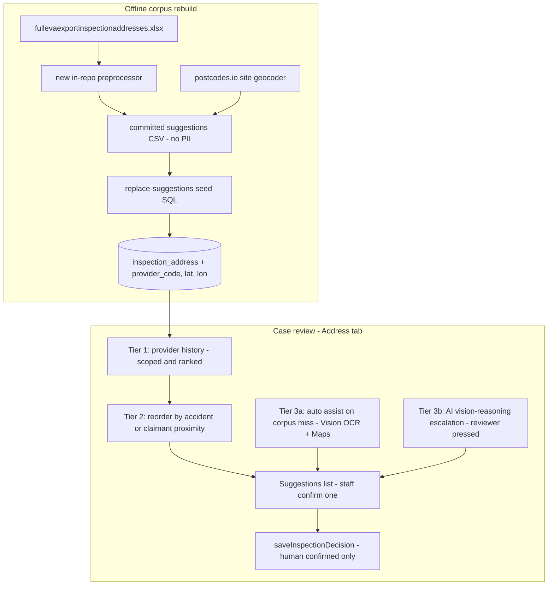

# Inspection Address Suggestions — Full Repair & Activation Plan

## Why it doesn't work today (verified root causes)

1. **Provider scoping is silently broken.** `GET /api/cases/{id}/inspection-suggestions` ([api/src/functions/inspection.ts](../../api/src/functions/inspection.ts)) filters on `s.providerCode`, which [api/src/lib/mappers.ts](../../api/src/lib/mappers.ts) parses from a `provider=` token in `source_note` — but the Postgres seed ([migration/assets/schema/seed/910_seed_corpus.sql](../../migration/assets/schema/seed/910_seed_corpus.sql)) never writes `source_note`; the provider only lives inside the display `label` (`'QDOS · Cariocca Business Park'`). Result: every case shows all ~2,035 suggestions interleaved across all providers (every provider's rank-1 first).
2. **The corpus was built from a bad provider parse.** The (not-in-repo) preprocessor used the leading alpha prefix of `Case ID`, so `a.qdos…` → provider "A" (3,064 rows), `ap.qdos…` → "AP" (1,590), `a.pch…` → "A". Confirmed: `a.`/`ap.` = audit, `d.` = diminution markers — the real provider follows the dot (QDOS is actually ~7,412 rows; PCH ~1,286 rows was invisible). Postcode variants (`B5 6JX` vs `B56JX`) split one site into duplicates; site names (`InspLocName`) are dropped from suggestions; 112 usable name+postcode-only rows are excluded; the image-based filter misses the `"Image Based Asessment"` typo (97 rows).
3. **Tier 2 (accident-location proximity) was never built** — only designed (ADR-0016 #2b).
4. **Tier 3 (vision/geolocate) is built but dormant**: `functions/location-suggest` is not deployed, gates (`LOCATION_ASSIST_ENABLED`, `AZURE_MAPS_ENABLED`, `LOCATION_ASSIST_API_BASE`) are unset live, Azure Maps/Vision aren't provisioned, and the photo source is a stub ([functions/location-suggest/photo_source.py](../../functions/location-suggest/photo_source.py)). It also only does deterministic OCR→address-geocode (business-name signage needs POI search, and there's no AI reasoning tier for background/phone-number/partial clues).

Guardrail that stays: **ADR-0013** — everything below is suggestion + human confirm; nothing ever auto-applies an address.

## Phase A — Rebuild the corpus pipeline (in-repo this time)

New `scripts/inspection-corpus/` (Python, stdlib-only xlsx parsing — already proven to work in this repo without openpyxl):

- `preprocess_eva_export.py` reads [docs/reference/fullevaexportinspectionaddresses.xlsx](../../docs/reference/fullevaexportinspectionaddresses.xlsx) and emits a committed, PII-free CSV (provider, site lines, postcode, frequency, last_seen, rank + status columns; no insured names/VRMs/claim numbers):
  - **Marker-aware provider parse**: strip `^[a-z]{1,2}\.` audit/diminution markers, provider = alpha prefix after the dot (`ap.qdos25448` → `QDOS`); keep the VRM-shaped-Case-ID exclusion and drop junk IDs (`test`, bare names).
  - **Normalise postcodes** deterministically before dedup (`B56JX` → `B5 6JX`).
  - **Dedup per (provider, normalised site)** — site key = normalised address + postcode, tolerant of `&`/`and` and whitespace variants in names; recompute frequency / last-seen / rank per provider.
  - **Carry the site name**: suggestion lines = `[InspLocName, InspLocAdd, InspLocAdd1-if-different]`; keep name+postcode-only rows (site with no street line is still a usable site).
  - **Typo-tolerant image-based drop** (`Image Based Asessment`, hyphen/case variants) and no-site drop.
  - Emit a run report: per-provider site counts + image-based share (operator input for helper-#1 policy designation — stats never auto-set policy, per ADR-0016).
- `geocode_sites.py` (separate, network step): fill site lat/lon via postcodes.io bulk postcode lookup (free, no key); blanks stay null.
- **Additive DDL** on [migration/assets/schema/040_inspection_address.sql](../../migration/assets/schema/040_inspection_address.sql) + a delta migration: `provider_code varchar(16)`, `latitude`/`longitude double precision` (nullable).
- New idempotent seed `920_replace_suggested_addresses.sql`: backup-first, delete only `source_label LIKE 'suggested%'` rows not in the new set, upsert the rest with `provider_code`, lat/lon, and a proper `source_note` (`provider=XXX source=eva_export`); confirmed rows untouched. Update the [seed README](../../migration/assets/schema/seed/README.md) path (the old `dataverse/.build` CSV path is dead).

## Phase B — Fix provider scoping + ranking in the Data API

- [api/src/lib/mappers.ts](../../api/src/lib/mappers.ts): `rowToSuggestedAddress` reads `provider_code` column first (fallback: label prefix / note token for legacy rows); add `distanceMiles` to the DTO.
- [api/src/functions/inspection.ts](../../api/src/functions/inspection.ts):
  - Scope server-side (`WHERE provider_code = $providerCode`), marker-tolerant Case/PO prefix parse.
  - **Kill the firehose fallback** (`scoped.length > 0 ? scoped : all`): an unknown provider returns an empty corpus list (the assist covers it), never the whole corpus.
  - **Tier 2 proximity**: pull the case's `eva_accident_circumstances` + `eva_claimant_address`, extract a postcode (deterministic regex, same shape as [functions/location-suggest/clue_extraction.py](../../functions/location-suggest/clue_extraction.py)), resolve to a centroid via postcodes.io (small in-memory cache), compute distance to each suggestion's lat/lon and blend ordering (history rank primary; proximity breaks ties / boosts nearby sites) + return the distance hint. Ordering only — ADR-0013 intact.
  - Cap the response (top ~12, rest behind "show more" in the UI).
- Unit tests: scoping, marker parse, proximity blend, empty-provider behaviour.

## Phase C — Activate tier 3 deterministic assist (Vision OCR + Maps)

- **Photo source** ([functions/location-suggest/photo_source.py](../../functions/location-suggest/photo_source.py)): implement `BlobPhotoSource` (evidence bytes already live in Blob `cespkevidstdev01` via `evidence.storage_path` — simplest, free) with `BoxPhotoSource` fallback for rows whose blob was purged after Box mirroring (reuse the `functions/box-webhook/box_client.py` JWT pattern; Box is live). The API proxy ([api/src/functions/proxy.ts](../../api/src/functions/proxy.ts)) enriches `photo_refs` with `storage_path`/`box_file_id` from the `evidence` table so the SPA contract doesn't change.
- **Signage lookup fix**: business names from OCR ("Somstar Recovery") rarely resolve via Search *Address* — add Azure Maps **fuzzy/POI search** for signage queries in [functions/location-suggest/maps_client.py](../../functions/location-suggest/maps_client.py); keep address search for postcode/address clues. Also pass the case provider's corpus sites as `corpus_match` candidates when a geocoded hit lands near one.
- **Provision + deploy** (operator `az login` first — gated.md A0): Azure Maps Gen2 + AI Vision F0 in `rg-collisionspike-dev` (both free-tier at our volume), keys → Key Vault; deploy the `location-suggest` Function App ([functions/location-suggest/infra/main.bicep](../../functions/location-suggest/infra/main.bicep)); set `LOCATION_SUGGEST_FN_URL/KEY`, `LOCATION_ASSIST_ENABLED=true`, `AZURE_MAPS_ENABLED=true`, `LOCATION_ASSIST_API_BASE` on `cespk-api-dev`.
- **Auto-run + button** ([mockup-app/src/screens/CaseDetail.tsx](../../mockup-app/src/screens/CaseDetail.tsx)): auto-invoke the assist once when the corpus returns no usable suggestions and the case has photos (auto-*suggest*, never auto-apply); keep the "Suggest location" button always visible when gated on, so a reviewer can second-guess any address.

## Phase D — AI vision-reasoning escalation (tier 3b)

Per the existing design ([docs/plans/phase-4-address-and-chaser/gpt4o-reasoning-escalation.md](../../docs/plans/phase-4-address-and-chaser/gpt4o-reasoning-escalation.md)), built as an escalation branch inside the same Function:

- Deploy a vision-capable Azure OpenAI model (gpt-4o class) — reuse the existing `digital-3339-resource` (currently zero deployments) or a new AOAI resource in the rg; keyless/MI preferred.
- Escalation branch: fires when the deterministic tier returns nothing confident; structured outputs (`json_schema`, strict), temperature 0, ≤3–4 photos at low detail, prompt rules "only report what is visibly evidenced; never invent street numbers/postcodes"; reasons over signage, street signs, phone numbers, business names, background landmarks; provider corpus site names passed as matching context; candidates re-geocoded via Maps and returned with `ai_reasoning` provenance.
- Cost controls: own gate (`LOCATION_ASSIST_AI_ENABLED`), per-case + per-day caps, App Insights spend telemetry, Azure budget alert (~£20/mo tripwire; expected <£5/mo).
- UI: when tier-3a is weak, surface a clearly-labelled "Try a deeper photo-based suggestion" action (reviewer-pressed by default; auto-escalate behind config).
- Operator prerequisite: per-gate AI production sign-off (docs/gated.md E2) — testing is already authorised, production flip is the operator's call.

## Phase E — UI polish + provider policy plumb

- Plumb the provider's real `inspectionLocationPolicy` into the CaseDetail confirm path (the FOLLOW-UP at [CaseDetail.tsx line ~1037](../../mockup-app/src/screens/CaseDetail.tsx)); for operator-designated `always_image_based` providers, surface an "Image Based Assessment (provider default)" suggestion chip — surfaced, never auto-applied.
- Suggestion rows gain: distance hint ("~3 miles from accident"), provider chip, capped list with "show more".

## Phase F — Reseed live, deploy, verify, document

- Runbook order: backup live `inspection_address` → apply DDL delta → run seed replace → verify counts (suggested rows by provider; every previously-confirmed row preserved — tallies live in the [registry](../architecture/live-environment.md)) → deploy API + SPA + Function → smoke-test one case per major provider (QDOS, PCH, QCL, FW) + one assist run on a photo case.
- Update docs: [docs/architecture/inspection-address-corpus.md](../../docs/architecture/inspection-address-corpus.md) (new in-repo pipeline + marker rule), ADR-0016 note, [docs/gated.md](../../docs/gated.md), LIVE_FACTS/live-environment registry; short ADR note recording that auto-*suggest* on corpus miss is within ADR-0013.
- `node verify-all.mjs` green across api / domain / mockup-app / location-suggest.

## Known constraints

- Azure CLI session may need re-auth (`az login`, gated.md A0) before any live provisioning/deploy — operator step.
- Subscription is still Free Trial (gated.md A1) — activation is provisional until upgraded.
- Live DB writes follow the established backup-first pattern; only the `suggested:*` layer is replaced.