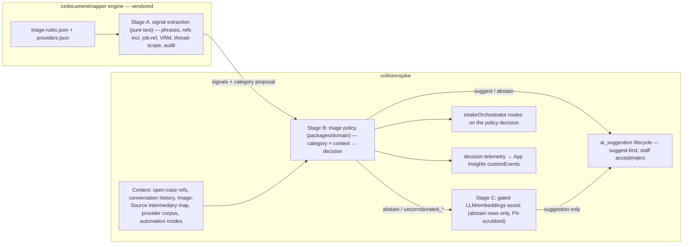

# Rules Engine v2 — Categorisation & Identification

> **Working copy.** Amended in place 2026-07-02 after a full evidence review (live Azure + both repos +
> the two sibling PRs + Microsoft Learn, cross-checked by explorer/critic agents). At **Phase-0
> kickoff** this file distills into [`docs/plans/phase-8-inbox-management/`](./phase-8-inbox-management/README.md)
> (this initiative is ROADMAP **Phase 8**'s Azure-era realization) plus tickets, and gets an index row in
> [`docs/plans/README.md`](./README.md). **Live state is never embedded here** — all live facts
> (deployments, gates, counts, quota) live in the registry:
> [LIVE_FACTS.json](../../LIVE_FACTS.json) / [live-environment.md](../architecture/live-environment.md).

## Evidence base (verified 2026-07-01/02; corrected from the first draft)

**Live probes** (real ticket emails replayed against the deployed `/classify-email`): the deterministic
classifier already handles TKT-029/030/033/036/037/038/040 correctly (digest→`case_summary`,
chaser→`query_existing_work`, invoice→`billing`, "Thanks Ed"→`acknowledgement`, roadworthy+photos→
`receiving_work`). Treat these as **verified-by-eval but fragile until Phase 2** — their thread-scoping
root cause is locked in only by the Phase-1 corpus + Phase-2 policy. The remaining live failures are
**context failures**, not text failures:

- `Claim Cancelled - SBL-B0649696` → `other/other` at abstain confidence (TKT-041 — no cancellation concept).
- Connexus/PCH inspection request → `new_client_work` + Held (TKT-021/051 — no Image-Source intermediary
  resolution; the doc-detected provider string never maps to a `work_provider_id` → TKT-028, though its
  headline example may already be fixed live — **verify via the eval corpus first**).
- `Our ref: 576299` follow-up mints a new case (TKT-023): the pre-mint path never checks job refs against
  open cases — [`linkReply`](../../orchestration/src/functions/activities/linkReply.ts) fires only for
  non-`receiving_work` replies ([intakeOrchestrator.ts](../../orchestration/src/functions/intakeOrchestrator.ts)
  §1.6) and receives only `ref`+`vrm`. **The engine already computes and returns `body_jobref`**
  ([email_classifier.py](../../functions/parser/cedocumentmapper_v2/rules/email_classifier.py) `_job_reference`) —
  it is dropped by the OpenAPI contract ([parser-connector.json](../../functions/parser/openapi/parser-connector.json))
  and the TS client ([functions-client.ts](../../orchestration/src/lib/functions-client.ts)) only.
- Orchestration doesn't send `attachment_filenames` — but the Python route **already accepts it** and has
  working report-attachment rules (TKT-037/039); this is a TS+OpenAPI change only.
- Signature images: [`graph.ts`](../../orchestration/src/lib/graph.ts) already drops `isInline===true`
  attachments; what's missing is a raster floor for **non-inline** signature images (TKT-047). Inbound
  images aren't routed to case/Box outside the linked-reply lane (TKT-034/043); case-updates vs queries
  aren't separated (TKT-046).

**Sibling PRs:** PR 4 upstreams the vendored-only classifier + reader/engine work (`email_classifier.py`
byte-identical to the vendored copy — verified); **PR 5 is a strict subset of PR 4** (the identical
decorative-raster hunk). The **vendored copy is AHEAD of sibling main** (= PR 4 tip + the hand-applied B2
reconciliation) — PROVENANCE's pin and its "vendored is BEHIND" note are stale; see
[PROVENANCE.md](../../functions/parser/cedocumentmapper_v2/PROVENANCE.md).

**Azure:** the resource group's AI Foundry account now carries the model deployments this plan's Stage C
targets (created by the operator 2026-07-01) — **deployment names/SKUs/quota live in the registry**
([live-environment.md](../architecture/live-environment.md)), which this plan updates as part of Phase-0
doc hygiene. No managed-identity grant or keyless posture exists on that account yet (Phase 4 wires it).

## Architecture verdict — split by what the rule needs to see (hybrid)

- **Stage A — text signals: stays in cedocumentmapper.**
  [`rules/email_classifier.py`](../../functions/parser/cedocumentmapper_v2/rules/email_classifier.py) is
  pure, $0, shares VRM/audit/ref regexes with document parsing, already does thread-scoping
  (quoted-reply stripping) and job-ref extraction, and is authored once + vendored (ADR-0018). Moving it
  out would fork the regex/normalization stack.
- **Stage B — routing policy: a new deterministic triage-policy module in `packages/domain`** (pure TS
  over injected context, unit-testable), called by the orchestrator — replacing the thin
  `category !== 'receiving_work'` switch. Everything that misclassifies today needs live context a pure
  text function cannot see: open-case refs, local thread correlation, the provider corpus, Image-Source
  intermediary maps, automation modes. `@cs/domain` is already the home of the inviolable pure rules
  (`resolveCase`, `matchProviderByDomain`) — the policy joins them. **The Stage-A/B boundary is recorded
  as ADR-0019 (a Phase-0 exit criterion).**
- **Stage C — gated LLM/embeddings assist**: the existing dormant
  [`triage-classify`](../../orchestration/src/functions/gated/triage-classify.ts) skeleton gets a real
  model call, **suggestion-only**, for abstain/`uncorroborated_*` rows (per ADR-0015's 2026-06-29 update,
  target the **signal flags**, not the confidence band alone).
- **Rule data externalized (scoped honestly):** the flat keyword/phrase tuples move into a
  schema-validated `triage-rules.json` alongside `providers.json`; the regexes, rule ordering, confidence
  bands and suppression logic **stay in Python**.

## Phase 0 — Consolidate the fork + pipeline hygiene (prereq)

- **Capture the sibling field-extraction eval baseline BEFORE merging** (`src/cedocumentmapper_v2/eval/`
  comparator + committed baseline) — PR 4 changes /parse behaviour for sibling-main consumers.
- **Merge sibling PR 4; close PR 5 as superseded** (strict subset — sequential merge risks an add/add
  conflict on the identical decorative hunk). Neither PR has CI: local pytest must be green first (incl.
  resolving the two known-failing parser tests). Add PR 4's `label_pairs` key to
  `extraction-rule.schema.json`; confirm nothing needed is stranded on `feat/audit-case-type-detection`.
- **Tag the engine release** (e.g. `engine-v2.1` — the sibling's **first tag**), then re-cut into
  `functions/parser/cedocumentmapper_v2/` per ADR-0018. The re-cut should be a **content no-op for the
  cloud path** (vendored is already ≡ PR 4 + B2) — **diff-verify before deploy**, re-apply the B2
  reconciliation, update the PROVENANCE pin + close its stale divergence notes, confirm
  `test_engine_vendored_in_sync` green with the sibling checked out. Verify the two PR-4 worker
  side-effects on the deployed Function (tempfile writes; `.doc` LibreOffice-fallback behaviour when
  soffice is absent). **The Phase-0 tag emits the v1 taxonomy only** (no new categories before Phase 2's DDL).
- **Contract pass-through:** send `attachment_filenames` from orchestration
  ([classifyInbound.ts](../../orchestration/src/functions/activities/classifyInbound.ts) /
  [functions-client.ts](../../orchestration/src/lib/functions-client.ts)); surface the engine's existing
  `body_jobref` through the OpenAPI schema → TS client → `InboundClassification`; **capture**
  `conversationId` (add to the Graph `$select` in [graph.ts](../../orchestration/src/lib/graph.ts) and
  carry it in the envelope — the column lands with Phase 2's DDL).
- Fix OpenAPI drift: `ClassifyEmailResponse` category enum (add `billing`, `non_actionable`) + the three
  missing subtypes + `body_jobref` property.
- **Author ADR-0019** (Stage-A/B boundary + Stage-C suggestion contract) — Phase-0 exit criterion.
- Redeploy parser + orch; verify with live probes. Doc hygiene rides along: registry `foundry` block,
  stale-docs sweep (PROVENANCE, gates.ts comment, BOARD TKT-015 note, ai-assistant pack).

## Phase 1 — Real-email eval harness (the accuracy yardstick)

- **Tier-3 real corpus** (local-only/gitignored at the established PII path
  `test-cases-and-data/e-mail-examinations/`): the 31 real `.eml` under `docs/tickets/**`, the 12 real
  `.msg` under `test-cases-and-data/test-cases/`, plus an **operator-gated export** of live
  `inbound_email` rows with staff `improvement_signal` overrides as labels (the SPA→`PATCH
  /api/inbound/{id}/classification`→`improvement_signal` loop is already live). **Labels carry a
  taxonomy-version field** (v1 now; re-label pass when Phase 2's v2 lands).
- **Eval runner — net-new classification scorer** (the sibling `eval/` package scores field extraction
  and stays off the vendored path per ADR-0018): per-category precision/recall + a K×K confusion matrix;
  wire as an **opt-in env-gated check in `verify-all.mjs`** (the `VERIFY_LIVE` skip pattern); record the
  **baseline before any rule change**.
- Feedback loop: script exports staff reclassifications → append to corpus → re-eval each release.

## Phase 2 — Taxonomy v2 + context-aware triage policy (the core upgrade)

- **Deploy order is part of the design:** the idempotent **additive DDL delta lands first**
  (operator-gated): `case_update` + `cancellation` categories, `images_received` subtype (append-only
  codes per the never-renumber doctrine in `000_enums_lookups.sql`), `inbound_email.body_jobref` +
  `conversation_id` columns. Only then ships the taxonomy-v2 engine tag + choicesets + SPA labels.
  Existing rows keep v1 codes (no backfill); SPA filters/metrics must state how mixed-vintage rows display.
- **Ref-gate, suggest-first:** a policy step for any inbound whose refs/job-ref/VRM match an **open**
  case — generalizing the existing linked-reply lane (which already runs classifyPersist + extractImages
  + boxArchiveEvidence + statusEvaluate on a linked case). **All matches start suggestion-only for one
  release**, riding the existing `ai_suggestion` accept/reject lifecycle + inbox affordance; **exact
  single open-case ref match** promotes to auto-attach only after corpus results + live staff confirms;
  **VRM-only matches stay suggest forever** (ADR-0010's no-ref rung). Extends `linkReply` to use
  `body_jobref` and to run pre-mint on `receiving_work` too (closes the TKT-023 leak). "Detach" =
  unlink + flag the Box folder for manual cleanup (Box is a one-way additive mirror — ADR-0012/0017; no
  un-archive is promised). New `inbound_*`/attach audit actions.
- **Mint race + cross-mailbox duplicates:** the same email delivered to two subscribed mailboxes yields
  two Graph message ids → two orchestrations, and a pre-mint ref-gate widens the race window. Add an
  **`internetMessageId` dedup rung** and **Data-API-side serialization** (Postgres advisory lock on
  ref/VRM around resolve/ref-gate). Every policy step runs as a **Durable activity** with a checkpointed
  result + persisted decision inputs and a stated idempotency contract.
- **Thread correlation (secondary signal):** correlate **locally in Postgres** on the captured
  `conversationId` (nothing system-sent exists in SentItems — the chaser send is a stub; staff replies
  land there out-of-band only). Graph `$filter=conversationId` is not contractually documented — if ever
  used: `eq`-only, no `$orderby`, URL-encode, live smoke-test first.
- **`case_update` vs `query_existing_work` precedence, defined:** ref-match + new evidence →
  `case_update`; ref-match + question-only → the query lane; cancellation phrases trump both. Encoded as
  confusion-matrix targets so the currently-correct chaser handling cannot regress.
- **Cancellation action:** matched case → **propose** close/hold with note + audit (staff-confirmed,
  never auto-close — consistent with the automation-mode ladder; `choice_case_status` already has the
  terminal `removed` state).
- **Images-received routing** (TKT-034/043): matched → suggest-attach + Box; unmatched with VRM →
  reg-keyed Box dumping folder + flag (ADR-0015 §5).
- **Signature filter:** extend the existing `isInline` skip with a raster floor for non-inline images
  mirroring PR 5's semantics (pixel **area** floor, unknown-dimensions-kept) — Graph supplies bytes only,
  so use a small PNG/JPEG header dimension-sniff with a byte-size fallback (TKT-047).
- **Decision telemetry + kill-switches:** every policy decision (would-be action + inputs, rule/policy
  version) logs to App Insights **customEvents** always-on; behaviors ship behind default-off
  app-setting gates (`TRIAGE_REF_GATE_ENABLED`, `TRIAGE_CANCELLATION_ENABLED`, …). No shadow rows in
  `ai_suggestion` while its gate is off.

## Phase 3 — Identification upgrade (provider / Image-Source intermediary)

- **ADR-0011 implemented as written** (CONTEXT.md canon: the entity is **Image Source** — avoid a new
  "intermediary" table): `image_source` rows with `kind=intermediary` + `email_domain` match keys (table
  live + seeded; `030_image_source.sql`), plus a **new N:N `image_source ↔ work_provider`** join
  (`connexus.co.uk` → {PCH, SBL}) and de-colliding `knownEmailDomains`; add `@pch-ltd.com` etc. from the
  real ticket senders (TKT-021/051).
- **Document-content provider resolution feeds identity** (ADR-0011's second decision — doc content is
  the *primary* signal): map the parser's detected `work_provider` string → `work_provider_id` at
  `caseResolve` (the string already forwards fill-if-empty with provenance; the id mapping + mint/Held
  influence is the new part). **TKT-028's headline example may already be fixed — verify via the corpus
  before building.**
- **Content-based attachment typing:** run provider `detect_phrases` / `engineer_report` markers over
  extracted text to type `instruction` vs `report` vs `junk` by content, not extension (hardens Rule 1's
  corroboration gate). Net-new — current report detection is filename-regex only.

## Phase 4 — Gated AI assist (Stage C; build gated-off, operator flips)

- **Replace the dormant stub's body** (`gated/triage-classify.ts` currently re-calls the deterministic
  route): an AOAI **structured-output** call constrained to the taxonomy, wired post-classify for
  **abstain/`uncorroborated_*` rows only**, writing `suggested_*` + a row in the **existing
  `ai_suggestion` lifecycle** (accept/reject/supersede + audit actions), `classifier_mode='llm'`, never
  auto-mints. Two gates by name: `EMAIL_AI_ENABLED` (the orch LLM call) and `AI_ASSIST_ENABLED` (the API
  suggestion surface).
- **Identity/keyless:** grant the orch app's managed identity **Cognitive Services OpenAI User** on the
  Foundry account; call with Entra tokens (no key app-setting); then disable local auth — **operator-
  confirmed** (the account is operator-created and may have uses outside this repo; see
  [gated.md](../gated.md)).
- **PII + policy posture:** scrub subject/body through the existing
  [`pii-scrub`](../../packages/domain/src/domain/pii-scrub.ts) helper pre-call (counts-only telemetry);
  honour `work_provider.ai_allowed` + the global kill switch; treat `content_filter` 400s as **abstain**
  (accident/injury narratives can trip the default RAI policy); **pin the model version** (or stamp
  model+version into `ai_suggestion.model_version` and re-baseline the eval on change). Data-residency:
  the chat model is Global-deployment-only in this region (no UK data zone exists) — inference may
  process outside the UK while data-at-rest stays regional; the `EMAIL_AI_ENABLED` **production** flip is
  gated on the **G5 per-AI-gate sign-off** (testing on repo data is pre-authorised).
- **Model + API shape:** structured outputs on the GA v1 surface (`json_schema`, `strict:true`);
  reasoning-model constraints apply (no temperature/top_p/penalties/max_tokens → `max_completion_tokens`,
  `reasoning_effort` minimal/low, low verbosity; strict schema subset). **A/B `gpt-5-mini` vs `gpt-5`**
  on the corpus before any enable — quota/cost detail in the registry; at current volume the cost is
  pennies/month either way, so **the gate is residency, not spend**.
- **Embedding prior:** nearest-neighbours against the labelled corpus as a cheap re-rank signal, stored
  in `ai_suggestion`. Start with plain `float8[]`/`jsonb` columns + app-side cosine (tiny corpus);
  **pgvector** (`vector`, allowlisted but not enabled) is the documented scale path.
- **Eval A/B:** deterministic vs +LLM on the real corpus before any live enable.

## Phase 5 — Declarative ruleset + operability

- **Externalize the phrase data** (not the whole ruleset) into a schema-validated `triage-rules.json` in
  the engine (pattern: `provider-config.schema.json`); loader + tests on both sides of the vendor
  boundary. Note two new surfaces: runtime JSON validation on the cloud path (schema validation is
  desktop/test-only today), and the **desktop GUI/PyInstaller build must bundle + load the same JSON**
  (ADR-0018 dual-target; touch `build.ps1`).
- **SPA (under the binding constraints — review 010726 D14/D15/D16 + the no-engineering-language hard
  rule):** a handler-language "**Why this label?**" affordance (plain-English reasons in the tooltip/peek
  — the words "signals"/"rule-id"/"classifier"/"gated" never render), the source-mailbox chip + filter
  (TKT-025), and finish the actionable-inbox verification (TKT-005). Never delete `inbound_email` rows
  (audit-of-record); active-vs-handled semantics; hardened writes.
- **Rule promotion:** candidate rulesets prove themselves on the eval corpus + the always-on decision
  telemetry before promotion (no separate shadow phase at current volume).

## Ticket coverage

- Phase 2: TKT-023, TKT-034, TKT-041 (cancellation), TKT-043, TKT-046, TKT-047 — and the misclass
  cluster TKT-029/030/031/033/036/037/038/039/040 locked green via the eval corpus (verified-by-eval,
  fragile until Phase 2's thread-scope/context fix).
- Phase 3: TKT-021, TKT-028 (verify-first), TKT-051.
- Phase 4: TKT-015 groundwork (TKT-018 is an image VLM — out of scope here).
- Adjacent (not owned by this plan): TKT-024 (image-only new-case form ↔ 034), TKT-026 (queue counts ↔
  Phase-5 metrics), TKT-027 (`ingested` status interacts with ref-gate/cancellation actions), TKT-052
  (merge provider-loss — split out of the old TKT-041 folder, relates to TKT-028).
- Blocked/operator: TKT-032 (routing decision), TKT-035 (needs a sample) — taxonomy slots exist for both.

## Verification

- Sibling **field-extraction baseline before the Phase-0 merge**; Phase-1 classification baseline
  **before any rule change**; per-phase re-runs (targets: zero false new-cases on the 31 ticket emails;
  cancellation recall floor; no chaser-classification regression).
- Phase-0 re-cut diff-verified as a content no-op; `test_engine_vendored_in_sync` green with the sibling
  checked out; live probes after each deploy (`/classify-email` + one controlled end-to-end email per
  changed lane); pytest/vitest/`verify-all.mjs` + `check-doc-links` + `check-tickets` green.
- Phase 4: A/B (deterministic vs +LLM; gpt-5 vs gpt-5-mini) on the corpus before any `EMAIL_AI_ENABLED`
  flip. BOARD truth standard throughout: live-proven before `done`.

## Operator gates (registry + [gated.md](../gated.md) carry the live state)

Sibling PR-4 merge + first engine tag (ADR-0018 prereq) · the Phase-2 DDL delta apply · any
`EMAIL_AI_ENABLED` flip (G5/residency sign-off; E2) · the live `inbound_email` PII export for the corpus
(E2) · the Foundry local-auth flip (ownership check) · plus the standing A0 (`az login`) and A1
(Free-Trial→PAYG) prerequisites.
