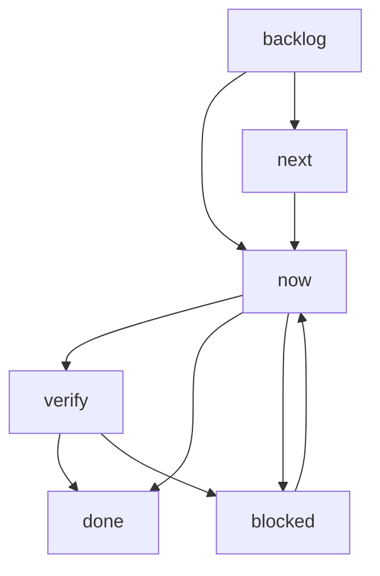

# Tickets — the atomic work system

> **What this is.** A Markdown-only ticket system: **one ticket = one per-ticket folder** holding the ticket spec, its `changes.md` + `verification.md` audit artifacts, and an `evidence/` folder, tracked on [BOARD.md](./BOARD.md). Tickets are the granular layer under [ROADMAP.md](../../ROADMAP.md). Live numbers stay in [LIVE_FACTS.json](../../LIVE_FACTS.json) / [live-environment.md](../architecture/live-environment.md), not in tickets.

## Where tickets live

```
docs/tickets/
  README.md   BOARD.md
  plans/PLAN-NNN-<slug>.md
  to-distill/
  backlog/ | now/ | next/ | verify/ | done/ | blocked/
    TKT-NNN-<slug>/
      TKT-NNN-<slug>.md
      changes.md
      verification.md
      evidence/
```

[to-distill/](./to-distill/README.md) is the indexed inbox for source notes and evidence that still
need to be converted into normal ticket folders.

The status folder and the ticket frontmatter `status` must match. Do not move ticket folders by hand; use:

```sh
node scripts/ticket-move.mjs TKT-NNN <backlog|now|next|verify|done|blocked>
```

That command changes frontmatter, moves the folder, relocates the BOARD row, and rewrites inbound links.

## Ticket file format

```yaml
---
id: TKT-001
title: Short plain-English title
status: verify        # backlog | now | next | verify | done | blocked
priority: P1          # P0 | P1 | P2 | P3
area: intake
tickets-it-relates-to: [TKT-002]
research-link: docs/tickets/verify/TKT-001-document-parsing/evidence/operator-note.md
plan: PLAN-001        # optional
---
```

| Field | Meaning |
|---|---|
| `id` | Unique `TKT-NNN` id. Never reused. |
| `title` | One-line plain-English summary. |
| `status` | `backlog` not started · `now` in flight · `verify` deployed/code-complete awaiting live proof · `done` verified · `next` queued · `blocked` waiting on a dependency/operator action. |
| `priority` | `P0`–`P3`. |
| `area` | Subsystem: parsing, evidence, box, intake, email, ui, dashboard, ai, platform, docs, pipeline, integration, enrichment. |
| `tickets-it-relates-to` | Dependency/sibling ticket ids, or `[]`. |
| `research-link` | Repo-relative path to the backing research pack or operator note. |
| `plan` | Optional plan id under [plans/](./plans/). |

## Lifecycle



**Truth standard:** `done` means live and proven in `verification.md`. Code that is written/deployed but awaiting live proof belongs in `verify`, not `done`.

## How tickets get worked

Two paths, one discipline:

- **Inline (single ticket)** — the `ticket-implement` skill: the working session reads, implements,
  records `changes.md`/`verification.md`, and moves status itself.
- **Delegated / batch** — the `ticket-orchestrate` skill: the main loop routes the ticket's `area` to a
  specialist agent (or the `ticket-implementer` fallback), enforces the lifecycle graph above (which
  `ticket-move.mjs` does **not** enforce), and gates `verify→done` on a **read-only `ticket-verifier`
  dispatch** — the party that implemented never self-certifies `done`. Dispatched agents **never** run
  `ticket-move.mjs` or write a verification verdict; status moves, BOARD **State** cells, and the
  **Index** section below stay with the dispatching loop (the mover script updates neither of the last two).

## Plans layer

Plans cluster related tickets without moving them. A plan lives at `docs/tickets/plans/PLAN-NNN-<slug>.md` with frontmatter `id`, `title`, `status: active|done|superseded`, `tickets`, and optional `depends-on`. Member tickets may carry `plan: PLAN-NNN`.

| Plan | Title | Status | Progress |
|---|---|---|---|
| [PLAN-001](./plans/PLAN-001-ai-mcp-hardening.md) | Harden and enhance AI features plus MCP | active | 8/17 done |
| [PLAN-002](./plans/PLAN-002-case-done-lifecycle.md) | Case done lifecycle | active | 1/3 done |
| [PLAN-003](./plans/PLAN-003-operator-fixup-wave.md) | Operator fix-up wave 2026-07-08 | active | 35/37 done |
| [PLAN-004](./plans/PLAN-004-production-readiness.md) | Production readiness and lifecycle completion | active | 1/53 done |

## Validation

```sh
node scripts/check-tickets.mjs
node scripts/check-doc-links.mjs
node scripts/check-skills-sync.mjs
```

`check-tickets` validates placement, frontmatter, research links, BOARD parity, plans, and eval-manifest ticket paths. The pre-commit hook and docs CI run these checks.

## Index — every ticket

### now

| Ticket | Title | Priority | Area | Plan |
|---|---|---|---|---|
| [TKT-009](./blocked/TKT-009-clickable-case-and-email/TKT-009-clickable-case-and-email.md) | Open an associated email in Outlook | P3 | ui | — |
| [TKT-020](./now/TKT-020-docs-cleanup/TKT-020-docs-cleanup.md) | Stale-plan cleanup + root-doc reconciliation | P2 | docs | — |
| [TKT-024](./verify/TKT-024-image-based-new-case/TKT-024-image-based-new-case.md) | Image-only new-case form (drop instruction-only fields) | P2 | ui | PLAN-003 |
| [TKT-034](./now/TKT-034-images-received-routing/TKT-034-images-received-routing.md) | Archive unmatched images by registration and adopt the folder into the case | P2 | intake | — |
| [TKT-041](./now/TKT-041-cancelled-case/TKT-041-cancelled-case.md) | Cancelled/closed-case emails have no home (no cancellation concept) | P1 | email | PLAN-004 |
| [TKT-067](./now/TKT-067-assistant-new-chat/TKT-067-assistant-new-chat.md) | Assistant drawer needs a "New chat" button to clear the conversation | P2 | ui | PLAN-001 |
| [TKT-068](./now/TKT-068-assistant-attach-evidence/TKT-068-assistant-attach-evidence.md) | Let the assistant understand images and add them to a case | P1 | ai | PLAN-001 |
| [TKT-102](./now/TKT-102-tractable-received-handling/TKT-102-tractable-received-handling.md) | Tractable received-email handling — categorise, match to case, parse PDF, extract images | P1 | intake | PLAN-004 |
| [TKT-129](./verify/TKT-129-image-based-inspection-done/TKT-129-image-based-inspection-done.md) | Simplify the inspection address or Image Based Assessment choice | P1 | ui | PLAN-003 |
| [TKT-130](./verify/TKT-130-review-queue-readiness/TKT-130-review-queue-readiness.md) | Review contains only cases that are ready for EVA | P1 | intake | PLAN-003 |
| [TKT-149](./done/TKT-149-reciprocal-pr-reviews/TKT-149-reciprocal-pr-reviews.md) | Retire mandatory reciprocal Claude and Codex PR reviews | P0 | platform | PLAN-004 |
| [TKT-107](./now/TKT-107-readonly-archive-assist/TKT-107-readonly-archive-assist.md) | "Read-only Box archive assist (suggest-only) — decouple from the sequence-blocked reconstruction" | P2 | intake | PLAN-001 |
| [TKT-021](./now/TKT-021-connexus-intermediary/TKT-021-connexus-intermediary.md) | Resolve Connexus claims-manager to the real provider (PCH/SBL) | P2 | intake | — |
| [TKT-141](./done/TKT-141-merged-twins-exclusion/TKT-141-merged-twins-exclusion.md) | Exclude merged/retired duplicate cases from twin counts and attention lists | P2 | dashboard | PLAN-003 |
| [TKT-144](./verify/TKT-144-blob-sha256-backfill-dedup/TKT-144-blob-sha256-backfill-dedup.md) | Resolve the 214 blob-lane same-name duplicate evidence rows via a sha256 backfill | P3 | evidence | PLAN-003 |
| [TKT-145](./verify/TKT-145-caselink-evidence-backfill/TKT-145-caselink-evidence-backfill.md) | Accepted case_link on a previously-uncased email must backfill its evidence to the case | P2 | intake | PLAN-003 |
| [TKT-146](./verify/TKT-146-box-upload-event-classify/TKT-146-box-upload-event-classify.md) | Classify images at Box-upload event time (the FILE.UPLOADED lane has no classify path) | P2 | evidence | PLAN-003 |
| [TKT-147](./verify/TKT-147-tractable-make-vin/TKT-147-tractable-make-vin.md) | Tractable layout: capture vehicle make (two-label rule) + a VIN field slot | P3 | parsing | PLAN-003 |
| [TKT-148](./verify/TKT-148-overview-photo-chaser/TKT-148-overview-photo-chaser.md) | Targeted overview-photo chaser for cases whose photo sets genuinely lack a vehicle overview | P2 | pipeline | PLAN-003 |


### verify

| Ticket | Title | Priority | Area | Plan |
|---|---|---|---|---|
| [TKT-016](./verify/TKT-016-ai-image-analysis/TKT-016-ai-image-analysis.md) | Image-analysis VLM sequence (vehicle / reg / location) | P2 | ai | PLAN-001 |
| [TKT-043](./done/TKT-043-misclass-images-received/TKT-043-misclass-images-received.md) | Images-received / report-chaser email misrouted (scope to confirm) | P2 | email | — |
| [TKT-044](./verify/TKT-044-mileage-calc-check/TKT-044-mileage-calc-check.md) | Mileage calculations look ~10,000 over expected values | P2 | enrichment | — |
| [TKT-047](./verify/TKT-047-email-sigs-box/TKT-047-email-sigs-box.md) | Email signature images archived to Box in error | P2 | intake | — |
| [TKT-052](./verify/TKT-052-merge-provider-loss/TKT-052-merge-provider-loss.md) | Merged image-only case loses the provider (merge logic wrong) | P2 | intake | — |
| [TKT-055](./verify/TKT-055-provider-api-intake/TKT-055-provider-api-intake.md) | Provider API intake channel (machine-to-machine case lodging) | P2 | intake | — |
| [TKT-066](./verify/TKT-066-assistant-lookup-observability/TKT-066-assistant-lookup-observability.md) | Assistant can't find a case by spaced registration + tool failures are invisible | P1 | ai | PLAN-001 |
| [TKT-069](./verify/TKT-069-assistant-more-tools/TKT-069-assistant-more-tools.md) | Assistant answers more questions — case detail, activity, twins, queues, emails, overdue | P2 | ai | PLAN-001 |
| [TKT-072](./done/TKT-072-global-search/TKT-072-global-search.md) | The search box doesn't search — global search across cases, emails, providers | P1 | ui | PLAN-001 |
| [TKT-077](./now/TKT-077-location-assist-photos/TKT-077-location-assist-photos.md) | Location assist can't see the case photos — real photo bytes + signage business lookup | P1 | ai | — |
| [TKT-078](./now/TKT-078-location-assist-ai-escalation/TKT-078-location-assist-ai-escalation.md) | Deeper photo-based location suggestion — AI reasoning escalation (gated) | P2 | ai | — |
| [TKT-084](./verify/TKT-084-pre-instruction-handling/TKT-084-pre-instruction-handling.md) | Pre-instruction directions email unidentified — define a handling lane | P2 | email | — |
| [TKT-094](./verify/TKT-094-case-done-status-model/TKT-094-case-done-status-model.md) | Case `done` terminal state — status model + auto-`eva_submitted` on export | P1 | intake | PLAN-002 |
| [TKT-095](./verify/TKT-095-case-done-detectors/TKT-095-case-done-detectors.md) | Case `done` detectors — manual → Box report-PDF → sent-email → EVA poll | P1 | intake | PLAN-002 |
| [TKT-110](./verify/TKT-110-mcp-readonly-server/TKT-110-mcp-readonly-server.md) | Read-only MCP server for external agents | P2 | ai | PLAN-001 |
| [TKT-111](./verify/TKT-111-assistant-write-tier/TKT-111-assistant-write-tier.md) | Assistant write tier with human confirmation | P2 | ai | PLAN-001 |
| [TKT-137](./verify/TKT-137-uncased-ai-suggestion-surface/TKT-137-uncased-ai-suggestion-surface.md) | Surface triage_category AI suggestions on uncased emails — currently written but invisible | P2 | ui | PLAN-003 |

### done

| Ticket | Title | Priority | Area | Plan |
|---|---|---|---|---|
| [TKT-001](./done/TKT-001-document-parsing/TKT-001-document-parsing.md) | Fix multi-format document extraction regression | P1 | parsing | — |
| [TKT-002](./done/TKT-002-pdf-image-extraction/TKT-002-pdf-image-extraction.md) | Auto-extract vehicle images from PDFs + flag unsuitable | P1 | evidence | — |
| [TKT-003](./done/TKT-003-box-sync/TKT-003-box-sync.md) | Get .eml / images / instructions into the Box folder | P1 | box | — |
| [TKT-005](./done/TKT-005-email-actions/TKT-005-email-actions.md) | Make the inbox actionable (dismiss removes from view) | P2 | email | — |
| [TKT-006](./done/TKT-006-suggested-tags-and-folders/TKT-006-suggested-tags-and-folders.md) | Suggest email categories/tags + Outlook folders, log overrides | P2 | email | — |
| [TKT-007](./done/TKT-007-amalgamated-dashboard/TKT-007-amalgamated-dashboard.md) | Combine email + intake overviews into one compact dashboard | P2 | ui | — |
| [TKT-008](./done/TKT-008-calendar-date-fields/TKT-008-calendar-date-fields.md) | Calendar picker on the date-of-incident / instruction fields | P3 | ui | — |
| [TKT-010](./done/TKT-010-delete-case/TKT-010-delete-case.md) | Close case (renamed from delete/remove) — confirm + audit, available to all users | P2 | ui | PLAN-003 |
| [TKT-011](./done/TKT-011-case-page/TKT-011-case-page.md) | Case page de-jargon + layout fixes | P2 | ui | — |
| [TKT-012](./done/TKT-012-dashboard-logic/TKT-012-dashboard-logic.md) | Define the combined dashboard/queue count contract | P2 | dashboard | — |
| [TKT-013](./done/TKT-013-automation-mode/TKT-013-automation-mode.md) | Define + enforce the per-provider automation modes | P2 | platform | — |
| [TKT-014](./done/TKT-014-acme-placeholder/TKT-014-acme-placeholder.md) | Remove the acme.co.uk placeholder from provider fields | P3 | ui | — |
| [TKT-015](./done/TKT-015-ai-assistant/TKT-015-ai-assistant.md) | AI suggestion layer (observation-first, gated) | P2 | ai | PLAN-001 |
| [TKT-017](./done/TKT-017-ai-reg-ocr/TKT-017-ai-reg-ocr.md) | Registration-recognition model research + bench | P2 | ai | PLAN-001 |
| [TKT-019](./done/TKT-019-ticket-system/TKT-019-ticket-system.md) | Build the Markdown ticket system + board + validator | P2 | docs | — |
| [TKT-022](./done/TKT-022-docx-extraction-fail/TKT-022-docx-extraction-fail.md) | .docx claim-form extraction fails | P1 | parsing | — |
| [TKT-023](./done/TKT-023-follow-up-docs/TKT-023-follow-up-docs.md) | Link follow-up documents/emails to the existing case + Box | P2 | intake | — |
| [TKT-025](./done/TKT-025-inbox-source-filter/TKT-025-inbox-source-filter.md) | Mark + filter inbox by source mailbox (info/engineers/desk) | P2 | email | — |
| [TKT-026](./done/TKT-026-queue-tracking/TKT-026-queue-tracking.md) | Queue counts don't match the actual queues | P2 | dashboard | — |
| [TKT-027](./done/TKT-027-intake-triage-status/TKT-027-intake-triage-status.md) | Intermediate intake status beyond 'new' | P2 | intake | — |
| [TKT-028](./done/TKT-028-work-provider-not-populating/TKT-028-work-provider-not-populating.md) | work_provider not populating on intake | P1 | parsing | — |
| [TKT-029](./done/TKT-029-misclass-case-summary/TKT-029-misclass-case-summary.md) | Case-summary email misclassified as new case | P2 | email | — |
| [TKT-030](./done/TKT-030-misclass-chasing-report/TKT-030-misclass-chasing-report.md) | Report-chaser misclassified as new work | P1 | email | — |
| [TKT-031](./done/TKT-031-misclass-client-chasing/TKT-031-misclass-client-chasing.md) | Client report-chaser misrouted to 'Other' | P2 | email | — |
| [TKT-033](./done/TKT-033-misclass-email-reply/TKT-033-misclass-email-reply.md) | Simple reply to our query misclassified as new work | P1 | email | — |
| [TKT-036](./done/TKT-036-misclass-instructions/TKT-036-misclass-instructions.md) | Work-instructions email misclassified as query | P1 | email | — |
| [TKT-037](./done/TKT-037-misclass-invoice-request/TKT-037-misclass-invoice-request.md) | Invoice request misclassified as new case | P2 | email | — |
| [TKT-038](./done/TKT-038-misclass-query-ack/TKT-038-misclass-query-ack.md) | Bare acknowledgement ('Thanks Ed') misclassified as query | P2 | email | — |
| [TKT-039](./done/TKT-039-misclass-query-report-support/TKT-039-misclass-query-report-support.md) | Report-support request misclassified as new case | P2 | email | — |
| [TKT-040](./done/TKT-040-misclass-roadworthy-request/TKT-040-misclass-roadworthy-request.md) | Informal roadworthy work-request misrouted to 'Other' | P2 | email | — |
| [TKT-046](./done/TKT-046-seperate-case-updates/TKT-046-seperate-case-updates.md) | Separate case updates from general queries (own lane + attach-to-case) | P2 | email | — |
| [TKT-048](./done/TKT-048-no-image-previews/TKT-048-no-image-previews.md) | Inbox/case image previews not rendering | P2 | ui | — |
| [TKT-049](./done/TKT-049-incorrect-claimant-email/TKT-049-incorrect-claimant-email.md) | Claimant email wrongly set to AX team inbox | P1 | parsing | — |
| [TKT-050](./done/TKT-050-ax-pdf-extract/TKT-050-ax-pdf-extract.md) | AX PDF accident circumstances extraction too deep | P1 | parsing | — |
| [TKT-051](./done/TKT-051-pch-connexus/TKT-051-pch-connexus.md) | PCH not identified — doc-content name + @pch-ltd.com senders both missed | P2 | intake | — |
| [TKT-054](./done/TKT-054-ui-work/TKT-054-ui-work.md) | Inbox simplification + VRM/Ref split + dashboard inbox-panel regressions | P1 | ui | — |
| [TKT-056](./done/TKT-056-audit-case-type-activation/TKT-056-audit-case-type-activation.md) | Audit case-type end-to-end — activation (delta + shadow review + gate flip + live probe) | P1 | intake | — |
| [TKT-058](./done/TKT-058-retro-case-creation/TKT-058-retro-case-creation.md) | Retroactive case creation (reconstruction fallback for un-linked update/billing email) | P1 | intake | — |
| [TKT-059](./done/TKT-059-replay-wipe-rebuild/TKT-059-replay-wipe-rebuild.md) | "Replay: wipe & rebuild derived data from full mailbox history" | P1 | intake | — |
| [TKT-060](./done/TKT-060-ai-chat-helper/TKT-060-ai-chat-helper.md) | AI chat helper — read-only Q&A assistant drawer | P2 | ui | PLAN-001 |
| [TKT-061](./done/TKT-061-box-cli-webhook-e2e/TKT-061-box-cli-webhook-e2e.md) | Box CLI + FILE.UPLOADED webhook + sandboxed E2E | P2 | integration | — |
| [TKT-062](./done/TKT-062-inspection-shortlist/TKT-062-inspection-shortlist.md) | Inspection-address picker returns entire corpus — add ranked shortlist | P2 | ui | — |
| [TKT-063](./done/TKT-063-go-live-docs/TKT-063-go-live-docs.md) | Go-live runbook, readiness matrix & operator checklist | P1 | docs | — |
| [TKT-064](./done/TKT-064-image-classification/TKT-064-image-classification.md) | Auto-classify evidence images — role (overview/damage) + registration visible | P2 | pipeline | PLAN-001 |
| [TKT-065](./done/TKT-065-audit-provider-resolution/TKT-065-audit-provider-resolution.md) | Audit cases resolve NO work provider (leaked "EVA (Engineers)" masked a real bug) | P1 | pipeline | — |
| [TKT-070](./done/TKT-070-email-body-readability/TKT-070-email-body-readability.md) | Inbox email previews are one unreadable line — keep line breaks, cut noise | P2 | email | PLAN-003 |
| [TKT-071](./done/TKT-071-vrm-false-positive-hd4110/TKT-071-vrm-false-positive-hd4110.md) | Job references like HD4110 wrongly captured as a vehicle registration | P1 | parsing | — |
| [TKT-073](./done/TKT-073-varchar16-overflow-clamp/TKT-073-varchar16-overflow-clamp.md) | Intake write fails with "value too long" — clamp over-length field before insert | P2 | intake | — |
| [TKT-074](./done/TKT-074-shell-hook-fail-closed/TKT-074-shell-hook-fail-closed.md) | Every terminal command is blocked — the Box scope-guard hook fails closed | P0 | platform | — |
| [TKT-075](./done/TKT-075-inspection-corpus-pipeline/TKT-075-inspection-corpus-pipeline.md) | Rebuild the inspection-address corpus in-repo — correct provider attribution + geocodes | P1 | platform | — |
| [TKT-076](./done/TKT-076-inspection-provider-scope-proximity/TKT-076-inspection-provider-scope-proximity.md) | Inspection suggestions ignore the provider and distance — real scoping + nearest-first | P1 | ui | — |
| [TKT-079](./done/TKT-079-inspection-ui-provider-policy/TKT-079-inspection-ui-provider-policy.md) | Address picker polish — provider default chip, distance hints, show-more | P2 | ui | — |
| [TKT-080](./done/TKT-080-inspection-reseed-live/TKT-080-inspection-reseed-live.md) | Reseed the live address catalogue + deploy and prove the whole inspection repair | P1 | platform | — |
| [TKT-081](./done/TKT-081-misclass-ack-batch/TKT-081-misclass-ack-batch.md) | Acknowledgement emails still misclassified — tagged as query/new case, one opened a blank case | P1 | email | — |
| [TKT-082](./done/TKT-082-misclass-query-as-new-work/TKT-082-misclass-query-as-new-work.md) | Existing-case query misclassified as new client work | P1 | email | — |
| [TKT-083](./done/TKT-083-misclass-instructions-unidentified/TKT-083-misclass-instructions-unidentified.md) | Instructions email left "Unidentified" despite detected instruction signals | P1 | email | — |
| [TKT-085](./done/TKT-085-vrm-false-positive-october/TKT-085-vrm-false-positive-october.md) | Registration on case A.PCH26003 logged as "OCTOBER" (VRM false positive) | P1 | parsing | — |
| [TKT-086](./done/TKT-086-circumstances-extraction-gaps/TKT-086-circumstances-extraction-gaps.md) | Accident circumstances still not being 100% extracted | P1 | parsing | — |
| [TKT-087](./done/TKT-087-box-upload-409-conflicts/TKT-087-box-upload-409-conflicts.md) | Box report shows 409 upload conflicts — investigate duplicate archive attempts | P2 | box | — |
| [TKT-088](./done/TKT-088-image-role-classification-check/TKT-088-image-role-classification-check.md) | Image role auto-classification — confirm whether it works and decide the path | P2 | evidence | PLAN-001 |
| [TKT-089](./verify/TKT-089-non-vehicle-images-box/TKT-089-non-vehicle-images-box.md) | Confirm non-vehicle images (signatures/logos) are no longer captured or stored on Box | P2 | evidence | — |
| [TKT-090](./done/TKT-090-evidence-filename-provider-vrm/TKT-090-evidence-filename-provider-vrm.md) | Evidence filenames carry a wrong "RJS" provider token and "UnknownVRM" | P2 | evidence | — |
| [TKT-091](./done/TKT-091-outlook-move-fail/TKT-091-outlook-move-fail.md) | Outlook "File to …" move fails live with a 503 from the Data API | P1 | email | — |
| [TKT-092](./done/TKT-092-pch-duplicate-cases/TKT-092-pch-duplicate-cases.md) | PCH cases duplicating for no reason | P1 | intake | — |
| [TKT-093](./done/TKT-093-auto-attach-matched-emails/TKT-093-auto-attach-matched-emails.md) | Auto-attach matched emails to their case instead of a hidden suggest dialog | P1 | email | — |
| [TKT-096](./done/TKT-096-completed-archive-view/TKT-096-completed-archive-view.md) | Completed/Archive view + dashboard drill-through + terminal-scope search fold-in | P2 | ui | PLAN-002 |
| [TKT-097](./done/TKT-097-cancellation-misclass-query/TKT-097-cancellation-misclass-query.md) | Cancellation email misclassified as a case query | P2 | email | — |
| [TKT-098](./done/TKT-098-inbox-pagination/TKT-098-inbox-pagination.md) | Inbox pagination — cap the inbox page at 15 emails, paginate the rest | P3 | ui | — |
| [TKT-099](./done/TKT-099-qcl-case-po-generation/TKT-099-qcl-case-po-generation.md) | QCL cases not generating Case/PO correctly | P1 | intake | PLAN-003 |
| [TKT-100](./done/TKT-100-qdos-false-vrm-and2/TKT-100-qdos-false-vrm-and2.md) | QDOS false VRM "AND2" invented on emails that don't contain it | P1 | parsing | — |
| [TKT-101](./done/TKT-101-qdos-cases-wrong-linking/TKT-101-qdos-cases-wrong-linking.md) | QDOS — two distinct refs (46671/1, 46533/1) wrongly linked as one case | P1 | intake | — |
| [TKT-103](./done/TKT-103-tractable-reference-bug/TKT-103-tractable-reference-bug.md) | Tractable "768.00" wrongly captured as the reference number | P2 | parsing | — |
| [TKT-105](./done/TKT-105-remittance-payments-category/TKT-105-remittance-payments-category.md) | Remittance advice classified under payments/billing | P2 | email | — |
| [TKT-106](./done/TKT-106-remove-replay-backfill/TKT-106-remove-replay-backfill.md) | "Remove the non-viable replay-backfill driver + gate" | P2 | intake | — |
| [TKT-108](./done/TKT-108-completed-tickets-done-folder/TKT-108-completed-tickets-done-folder.md) | "Completed tickets → a done/ folder for easier management" | P3 | docs | — |
| [TKT-109](./done/TKT-109-image-based-provider-prefill/TKT-109-image-based-provider-prefill.md) | Pre-fill image-based inspections for image-led providers | P2 | intake | — |
| [TKT-112](./done/TKT-112-image-writer-reconcile/TKT-112-image-writer-reconcile.md) | Reconcile the two image-classification writers | P2 | ai | PLAN-001 |
| [TKT-113](./done/TKT-113-ai-usage-ledger/TKT-113-ai-usage-ledger.md) | AI usage ledger for model capacity controls | P3 | ai | PLAN-001 |
| [TKT-114](./done/TKT-114-ticket-move-transition-guard/TKT-114-ticket-move-transition-guard.md) | Enforce the ticket lifecycle transition graph in ticket-move.mjs | P2 | docs | — |
| [TKT-115](./done/TKT-115-orch-ocr-fn-url-host-mismatch/TKT-115-orch-ocr-fn-url-host-mismatch.md) | Fix orch OCR_FN_URL host — it points at azurewebsites.net but the OCR app is Functions-on-ACA (azurecontainerapps.io) | P1 | platform | — |
| [TKT-116](./done/TKT-116-queues-pagination/TKT-116-queues-pagination.md) | Paginate the case queues at 15 per page (same as the inbox) | P2 | ui | PLAN-003 |
| [TKT-117](./done/TKT-117-queues-last-update/TKT-117-queues-last-update.md) | Show a "Last update" line for each case in the queues view | P2 | ui | PLAN-003 |
| [TKT-118](./done/TKT-118-image-only-vrm-identity/TKT-118-image-only-vrm-identity.md) | Rename the "Image Based" case label + identify image-only cases by VRM (no Case/PO before instructions) | P2 | intake | PLAN-003 |
| [TKT-119](./done/TKT-119-retro-locate-ack-hardening/TKT-119-retro-locate-ack-hardening.md) | Retro case-locate failed on ref PHA5007 — acks must never mint, add an "Unable to Locate" outcome, explore Graph deleted-items | P1 | intake | PLAN-003 |
| [TKT-120](./done/TKT-120-fairway-payment-misclass/TKT-120-fairway-payment-misclass.md) | FAIRWAY LEGAL payment transfer marked Unidentified — should classify as payments/billing | P2 | email | PLAN-003 |
| [TKT-121](./done/TKT-121-email-type-dropdown-overflow/TKT-121-email-type-dropdown-overflow.md) | The "E-mail Type" dropdown fills the whole page — cap its height with a scrollbar | P3 | ui | PLAN-003 |
| [TKT-122](./done/TKT-122-dashboard-panel-alignment/TKT-122-dashboard-panel-alignment.md) | Align the dashboard containers — inbox and "Check the flagged details" do not line up | P3 | ui | PLAN-003 |
| [TKT-123](./done/TKT-123-exclude-label-reflection-warning/TKT-123-exclude-label-reflection-warning.md) | Rename "exclude (person reflection)" to "Exclude" + dismissible vision reflection warning on images | P2 | ui | PLAN-003 |
| [TKT-124](./done/TKT-124-photo-orderer-images-only/TKT-124-photo-orderer-images-only.md) | Photo orderer shows .eml files — it must list images only | P2 | ui | PLAN-003 |
| [TKT-125](./done/TKT-125-add-case-descriptor-removal/TKT-125-add-case-descriptor-removal.md) | Remove the field descriptors under the Add Case inputs (and the wrong "4-char" principal claim) | P3 | ui | PLAN-003 |
| [TKT-126](./done/TKT-126-eva-export-zip/TKT-126-eva-export-zip.md) | Export for EVA downloads a .zip of the JSON plus all the images | P1 | ui | PLAN-003 |
| [TKT-127](./done/TKT-127-ai-suggestions-generate-204/TKT-127-ai-suggestions-generate-204.md) | AI Assistant "Generate Suggestions" does not generate — devtools shows 204 no content | P1 | ai | PLAN-003 |
| [TKT-128](./done/TKT-128-imported-details-blank/TKT-128-imported-details-blank.md) | "Imported details — from the instruction document or email" renders blank | P2 | ui | PLAN-003 |
| [TKT-131](./done/TKT-131-image-role-classify-retry/TKT-131-image-role-classify-retry.md) | Classify the role-unknown evidence images — retry the backfill residue so cases can reach Ready for EVA | P1 | evidence | PLAN-003 |
| [TKT-132](./done/TKT-132-generate-suggestions-inputs/TKT-132-generate-suggestions-inputs.md) | Widen the AI-suggestion generate inputs beyond accident circumstances | P2 | ai | PLAN-003 |
| [TKT-133](./verify/TKT-133-evidence-dedup-box-kind/TKT-133-evidence-dedup-box-kind.md) | Deduplicate evidence rows (email + Box mirror twins) + fix the box-webhook kind at source | P2 | evidence | PLAN-003 |
| [TKT-134](./done/TKT-134-action-logs-humanize/TKT-134-action-logs-humanize.md) | Action-logs page renders raw engineering strings — humanize the staff-visible log lines | P3 | ui | PLAN-003 |
| [TKT-136](./done/TKT-136-parse-fallback-ref-guard/TKT-136-parse-fallback-ref-guard.md) | Guard the /parse fallback reference against money values and text fragments (RIGERANT R1234YF) | P2 | parsing | PLAN-003 |
| [TKT-138](./done/TKT-138-token-roles-claim-rename/TKT-138-token-roles-claim-rename.md) | Live staff tokens still carry the pre-rename "CollisionSpike.Admin" roles value — reconcile with the Superuser rename | P3 | platform | PLAN-003 |
| [TKT-139](./done/TKT-139-retro-search-tokenization/TKT-139-retro-search-tokenization.md) | Retro Outlook $search misses spaced-ref variants (Graph tokenization: PHA5007 vs PHA 5007) | P3 | intake | PLAN-003 |
| [TKT-140](./done/TKT-140-retro-backlog-drain/TKT-140-retro-backlog-drain.md) | Bulk retro backlog drain — reconstitute historical un-cased emails from Deleted Items | P2 | intake | PLAN-003 |
| [TKT-142](./done/TKT-142-boxfn-large-payload/TKT-142-boxfn-large-payload.md) | Box facade 502s on large base64 payloads — QDOS26029 archive stranded (17.6 MB .eml) | P1 | box | PLAN-003 |
| [TKT-143](./done/TKT-143-extraction-stems-identity/TKT-143-extraction-stems-identity.md) | Pass the resolved provider/VRM into /extract-images so extraction filenames carry real identity | P3 | evidence | PLAN-003 |

### next

| Ticket | Title | Priority | Area | Plan |
|---|---|---|---|---|


### backlog

| Ticket | Title | Priority | Area | Plan |
|---|---|---|---|---|
| [TKT-018](./backlog/TKT-018-ai-case-category/TKT-018-ai-case-category.md) | AI VLM total-loss vs repairable categorisation (deferred) | P3 | ai | PLAN-001 |
| [TKT-150](./now/TKT-150-claimant-extraction-held-audit/TKT-150-claimant-extraction-held-audit.md) | Restore claimant-name extraction and remediate affected held cases | P1 | parsing | PLAN-004 |
| [TKT-151](./verify/TKT-151-vehicle-enrichment-completeness/TKT-151-vehicle-enrichment-completeness.md) | Complete vehicle enrichment and warn when a registration cannot be resolved | P1 | enrichment | PLAN-004 |
| [TKT-152](./verify/TKT-152-canonical-mileage-estimator/TKT-152-canonical-mileage-estimator.md) | Consolidate vehicle lookups and harden the MOT mileage estimator | P1 | enrichment | PLAN-004 |
| [TKT-153](./verify/TKT-153-explicit-case-save/TKT-153-explicit-case-save.md) | Save case edits explicitly as one reviewed change | P1 | ui | PLAN-004 |
| [TKT-154](./backlog/TKT-154-mcp-image-ingestion/TKT-154-mcp-image-ingestion.md) | Add a constrained MCP image-ingestion lane for external agents | P1 | integration | PLAN-004 |
| [TKT-155](./verify/TKT-155-dashboard-three-state-layout/TKT-155-dashboard-three-state-layout.md) | Rebuild the dashboard around Not Ready, Review and Held | P2 | dashboard | PLAN-004 |
| [TKT-156](./verify/TKT-156-chaser-file-request/TKT-156-chaser-file-request.md) | Put an active archive upload link in every image chaser | P1 | box | PLAN-004 |
| [TKT-157](./backlog/TKT-157-handler-copy-audit/TKT-157-handler-copy-audit.md) | Remove dev copy and unnecessary explanatory text from the app | P2 | ui | PLAN-004 |
| [TKT-158](./backlog/TKT-158-case-remediation-rerun/TKT-158-case-remediation-rerun.md) | Rerun and account for every affected case after the fixes deploy | P1 | pipeline | PLAN-004 |
| [TKT-159](./now/TKT-159-feature-gate-intent-audit/TKT-159-feature-gate-intent-audit.md) | Reconcile every feature gate with intended production behavior | P1 | platform | PLAN-004 |
| [TKT-160](./backlog/TKT-160-delete-case-image/TKT-160-delete-case-image.md) | Delete an individual case image from every active store | P2 | evidence | PLAN-004 |
| [TKT-161](./backlog/TKT-161-image-based-reflection-policy/TKT-161-image-based-reflection-policy.md) | Allow reflection images for Image Based Assessment cases | P1 | evidence | PLAN-004 |
| [TKT-162](./backlog/TKT-162-nested-audit-archive/TKT-162-nested-audit-archive.md) | Nest QDOS audit work inside the standard case archive folder | P1 | box | PLAN-004 |
| [TKT-163](./backlog/TKT-163-merge-dialog-layout/TKT-163-merge-dialog-layout.md) | Repair the merge-case dialog layout | P2 | ui | PLAN-004 |
| [TKT-164](./done/TKT-164-inbound-counts-500/TKT-164-inbound-counts-500.md) | Restore the live inbound dashboard counts | P1 | platform | PLAN-004 |
| [TKT-165](./verify/TKT-165-add-evidence-upload/TKT-165-add-evidence-upload.md) | Make Add evidence upload the selected files | P0 | evidence | PLAN-004 |
| [TKT-166](./verify/TKT-166-manual-intake-evidence-upload/TKT-166-manual-intake-evidence-upload.md) | Persist instruction and extra files from Manual Intake | P0 | intake | PLAN-004 |
| [TKT-167](./verify/TKT-167-image-gap-chasers/TKT-167-image-gap-chasers.md) | Keep image chasers available until every image rule passes | P1 | pipeline | PLAN-004 |
| [TKT-168](./now/TKT-168-unify-not-ready-language/TKT-168-unify-not-ready-language.md) | Make Not Ready status language agree with the queue | P1 | ui | PLAN-004 |
| [TKT-169](./now/TKT-169-email-hover-preview-bounds/TKT-169-email-hover-preview-bounds.md) | Keep long email previews inside the visible window | P2 | ui | PLAN-004 |
| [TKT-170](./verify/TKT-170-website-enquiry-classification/TKT-170-website-enquiry-classification.md) | Classify website contact forms as Website enquiries | P1 | email | PLAN-004 |
| [TKT-171](./backlog/TKT-171-four-digit-case-po-sequence/TKT-171-four-digit-case-po-sequence.md) | Keep Case/PO numbering working after 999 | P1 | intake | PLAN-004 |
| [TKT-172](./backlog/TKT-172-manual-intake-duplicate-guard/TKT-172-manual-intake-duplicate-guard.md) | Check matching registrations before Manual Intake creates a case | P1 | intake | PLAN-004 |
| [TKT-173](./backlog/TKT-173-ax-instruction-acceptance-action/TKT-173-ax-instruction-acceptance-action.md) | Make AX instruction acceptance impossible to miss | P2 | intake | PLAN-004 |
| [TKT-174](./backlog/TKT-174-archive-evidence-preview/TKT-174-archive-evidence-preview.md) | Make Archive evidence previews load clearly and open larger | P2 | ui | PLAN-004 |
| [TKT-175](./backlog/TKT-175-archive-deletion-resilience-investigation/TKT-175-archive-deletion-resilience-investigation.md) | Investigate resilience to direct Archive changes | P1 | box | PLAN-004 |
| [TKT-176](./backlog/TKT-176-dashboard-period-wording/TKT-176-dashboard-period-wording.md) | Use clear period wording on the dashboard | P3 | ui | PLAN-004 |
| [TKT-177](./backlog/TKT-177-duplicate-case-resolution-workspace/TKT-177-duplicate-case-resolution-workspace.md) | Resolve likely duplicate cases in one workspace | P1 | intake | PLAN-004 |
| [TKT-178](./blocked/TKT-178-production-archive-cutover-reconciliation/TKT-178-production-archive-cutover-reconciliation.md) | Reconcile active cases and the Archive at production cutover | P0 | platform | PLAN-004 |
| [TKT-179](./backlog/TKT-179-evidence-image-decision-controls/TKT-179-evidence-image-decision-controls.md) | Make photo decisions explicit | P2 | ui | PLAN-004 |
| [TKT-180](./backlog/TKT-180-icon-semantic-consistency/TKT-180-icon-semantic-consistency.md) | Use one icon for each app concept | P3 | ui | PLAN-004 |
| [TKT-181](./backlog/TKT-181-truthful-image-analysis-states/TKT-181-truthful-image-analysis-states.md) | Show truthful photo-checking states | P1 | evidence | PLAN-004 |
| [TKT-182](./backlog/TKT-182-long-reference-layout/TKT-182-long-reference-layout.md) | Keep long email references inside their column | P3 | ui | PLAN-004 |
| [TKT-183](./backlog/TKT-183-name-variant-case-correlation/TKT-183-name-variant-case-correlation.md) | Match case emails when first names are shortened to initials | P1 | intake | PLAN-004 |
| [TKT-184](./backlog/TKT-184-out-of-office-no-action/TKT-184-out-of-office-no-action.md) | Treat automatic out-of-office replies as no action needed | P2 | email | PLAN-004 |
| [TKT-185](./backlog/TKT-185-override-provenance-audit/TKT-185-override-provenance-audit.md) | Audit what actually caused each category override | P1 | ai | PLAN-004 |
| [TKT-186](./backlog/TKT-186-provider-update-chase-category/TKT-186-provider-update-chase-category.md) | Separate provider chases from case queries | P2 | email | PLAN-004 |
| [TKT-187](./backlog/TKT-187-multi-case-provider-chase-linking/TKT-187-multi-case-provider-chase-linking.md) | Link one provider chase to every referenced case | P1 | intake | PLAN-004 |
| [TKT-188](./backlog/TKT-188-report-amendment-classification-reconstruction/TKT-188-report-amendment-classification-reconstruction.md) | Keep report amendments with the existing case | P1 | intake | PLAN-004 |
| [TKT-189](./backlog/TKT-189-search-result-affordance/TKT-189-search-result-affordance.md) | Make search results clearly actionable | P2 | ui | PLAN-004 |
| [TKT-190](./backlog/TKT-190-inbox-case-po-status-display/TKT-190-inbox-case-po-status-display.md) | Show complete case details in inbox statuses | P2 | ui | PLAN-004 |
| [TKT-191](./backlog/TKT-191-actionable-email-suggestions/TKT-191-actionable-email-suggestions.md) | Suggest email replies and urgency only when justified | P2 | email | PLAN-004 |
| [TKT-192](./backlog/TKT-192-triage-precase-category/TKT-192-triage-precase-category.md) | Keep triage requests outside the case queue until instructions arrive | P1 | intake | PLAN-004 |
| [TKT-193](./backlog/TKT-193-precase-evidence-holding-adoption/TKT-193-precase-evidence-holding-adoption.md) | Hold pre-case evidence and adopt it when instructions arrive | P1 | intake | PLAN-004 |
| [TKT-194](./backlog/TKT-194-unidentified-reason-explanation/TKT-194-unidentified-reason-explanation.md) | Explain why an email needs sorting | P2 | email | PLAN-004 |
| [TKT-195](./backlog/TKT-195-entra-staff-access-management/TKT-195-entra-staff-access-management.md) | Manage staff access with Microsoft work accounts | P1 | platform | PLAN-004 |
| [TKT-196](./backlog/TKT-196-video-frame-evidence-extraction/TKT-196-video-frame-evidence-extraction.md) | Create evidence stills from case videos | P3 | evidence | — |
| [TKT-197](./backlog/TKT-197-linked-email-identity-display/TKT-197-linked-email-identity-display.md) | Show a trustworthy registration and email reference on linked emails | P1 | intake | PLAN-004 |
| [TKT-198](./backlog/TKT-198-wrong-vehicle-evidence-detection/TKT-198-wrong-vehicle-evidence-detection.md) | Flag photos that show a different vehicle | P1 | evidence | PLAN-004 |
| [TKT-199](./backlog/TKT-199-repository-data-authority-docs/TKT-199-repository-data-authority-docs.md) | Make repository data authority explicit without weakening security | P1 | docs | PLAN-004 |
| [TKT-200](./now/TKT-200-guided-capture-sessions/TKT-200-guided-capture-sessions.md) | Add secure guided photo capture sessions | P1 | integration | PLAN-004 |

### blocked

| Ticket | Title | Priority | Area | Plan |
|---|---|---|---|---|
| [TKT-004](./blocked/TKT-004-case-po-generation/TKT-004-case-po-generation.md) | Allocate the next Case/PO number reliably | P1 | intake | — |
| [TKT-032](./blocked/TKT-032-misclass-defer-routing/TKT-032-misclass-defer-routing.md) | 'Deferred: clarify routing for audatex + PCD-diminution emails' | P3 | email | — |
| [TKT-035](./blocked/TKT-035-misclass-information-request/TKT-035-misclass-information-request.md) | Information-request misclassification (placeholder) | P3 | email | — |
| [TKT-057](./blocked/TKT-057-ap-diminution-refinement/TKT-057-ap-diminution-refinement.md) | AP. total-loss review flow + diminution (D.) detection grounding | P2 | intake | — |
| [TKT-104](./blocked/TKT-104-tractable-api-integration/TKT-104-tractable-api-integration.md) | Tractable API integration (deferred — blocked on vendor docs) | P3 | intake | — |
| [TKT-135](./blocked/TKT-135-circumstances-provider-samples/TKT-135-circumstances-provider-samples.md) | Circumstances coverage residual — needs one dropped sample per 0%-coverage provider layout | P2 | parsing | PLAN-003 |
