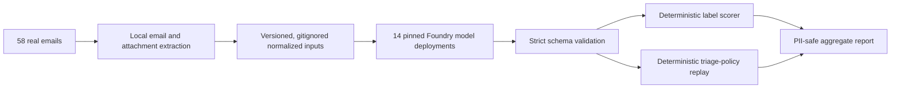

# Foundry multi-model parse-fed email evaluation plan

**Status:** Draft for execution

**Prepared:** 2026-07-14

**Scope:** Offline evaluation only; no production routing changes or live shadow period

**Related working notes:** [smallmodels.md](./smallmodels.md), [aifirstplan.txt](./aifirstplan.txt), [proposedparserchanges.md](./proposedparserchanges.md)

## 1. Decision summary

Evaluate every discussed Foundry model against the same 58 runnable real emails after local email and attachment extraction. Use one frozen prompt, one normalized input contract, strict structured outputs, and deterministic scoring against the existing hand-labelled expectations.

Foundry hosts and invokes the models. It is not the source of truth for scoring, and an LLM is not used as a judge. The expected category and subtype are closed-vocabulary labels, so ordinary code provides a cheaper, reproducible, and auditable evaluation.

The model may interpret message meaning, but it must never select a case ID or authorize an irreversible action. Case matching, ambiguity handling, duplicate handling, attachment, and case creation remain deterministic and are tested separately by replaying each model result through the same policy code.

## 2. Goals

- Identify the cheapest model that is reliable enough for parse-fed email classification.
- Compare GPT and non-GPT models on identical real inputs.
- Measure category/subtype quality, structured-output reliability, stability, latency, and actual token cost.
- Determine whether a small primary model plus a larger escalation model is better than one model for every message.
- Test the intended extraction-first architecture without changing live intake.
- Produce PII-safe, versioned evidence that can support a later implementation decision.

## 3. Non-goals

- No model fine-tuning. Fifty-eight emails are insufficient for independent training and evaluation.
- No live shadow traffic or production gate flip.
- No model-selected case association, case creation, cancellation, or duplicate drop.
- No raw PDF/image submission when native extraction or OCR succeeds.
- No use of generic benchmark scores as a substitute for the real-email corpus.
- No LLM-as-judge scoring where an exact deterministic comparison is possible.

## 4. Current benchmark

The tracked manifest currently contains 67 labelled entries:

- 58 runnable files: 46 `.eml` and 12 `.msg`.
- 9 local-only `.eml` entries are absent and are skipped by the existing baseline.
- No local overlay is currently present.

The execution gate in this plan covers the 58 runnable files. A run must abort if any of those 58 becomes unavailable or fails to load; it must not report a reduced corpus as a successful comparison.

### Category distribution

| Expected category | Items |
|---|---:|
| `receiving_work` | 19 |
| `cancellation` | 13 |
| `query` | 11 |
| `non_actionable` | 6 |
| `case_update` | 4 |
| `billing` | 3 |
| `pre_instruction` | 1 |
| `other` | 1 |
| **Total** | **58** |

The current deterministic baseline is approximately 51/58 exact category-and-subtype matches (87.9%). Query recall is materially weaker than the aggregate result, so overall accuracy alone cannot select a winner.

Before implementation, correct the stale references to a 44-item corpus in `scripts/eval-email/README.md` and any verification output.

## 5. Model matrix

The initial matrix contains 14 models. Exact model names and versions must be pinned in the run manifest; an unavailable version is recorded as unavailable rather than silently replaced.

| Group | Publisher | Model | Version to pin | Purpose |
|---|---|---|---|---|
| Control | OpenAI | `gpt-5` | `2025-08-07` | Current deployed-model control |
| Candidate | OpenAI | `gpt-5-nano` | `2025-08-07` | Low-cost GPT candidate |
| Candidate | OpenAI | `gpt-5.4-nano` | `2026-03-17` | Newer nano candidate |
| Candidate | OpenAI | `gpt-5-mini` | `2025-08-07` | GPT escalation candidate |
| Candidate | OpenAI | `gpt-5.4-mini` | `2026-03-17` | Newer GPT escalation candidate |
| Candidate | Microsoft | `Phi-4-mini-instruct` | `1` | Cheapest small Microsoft candidate |
| Candidate | DeepSeek | `DeepSeek-V4-Flash` | `2026-04-23` | Low-cost non-GPT candidate |
| Candidate | xAI | `grok-4-fast-non-reasoning` | `1` | Fast non-reasoning candidate |
| Candidate | Meta | `Llama-4-Maverick-17B-128E-Instruct-FP8` | `1` | Current Llama candidate |
| Candidate | Meta | `Llama-3.3-70B-Instruct` | `9` | Larger Llama comparison |
| Candidate | Mistral AI | `Mistral-Large-3` | `1` | Mistral comparison |
| Candidate | Cohere | `Cohere-command-a-plus-05-2026` | `1` | Cohere comparison |
| Candidate | Moonshot AI | `Kimi-K2.5` | `1` | Lower-cost Kimi comparison |
| Candidate | Moonshot AI | `Kimi-K2.6` | `2026-04-20` | Newer Kimi comparison |

All 14 were advertised to the existing `digital-3339-resource` with `GlobalStandard` support on 2026-07-14. Deployment capacity, quota, commercial terms, and structured-output support still require a preflight check.

## 6. Evaluation architecture



Extraction happens once per email, not once per model. Every model receives the same logical input. This removes parser variation from the model comparison and prevents one model from benefiting from a different PDF/OCR path.

## 7. Canonical input and output contracts

### Input

For each email, construct one normalized input containing:

- Sender domain and recognized-provider state.
- Subject and body.
- Reply/forward metadata required by the taxonomy.
- Attachment index and filename.
- Native or OCR extracted document text.
- Document typing and extraction source.
- Deterministically extracted VRM/provider-reference signals with provenance.
- Labelled open-case cardinality where the test requires it, but no live case ID.
- Closed-vocabulary parser issues and truncation indicators.

Treat all email and attachment content as untrusted data, never as model instructions.

Use the same common input budget for every model. Determine that budget from the smallest supported context window and the intended production cost ceiling. When content must be truncated, apply one deterministic policy and report the affected item; never silently use different truncation per model.

The normalized cache contains real PII and must be gitignored, local-only, and excluded from telemetry and chat transcripts.

### Output

The primary comparison asks the model only for:

```json
{
  "category": "closed taxonomy value",
  "subtype": "closed taxonomy value",
  "confidence": 0.0
}
```

Do not request a rationale during the model matrix. The current harness discards it, it adds token cost and variability, and it creates another place where source PII could be repeated.

Use strict JSON Schema where a deployment supports it. Where the API does not support strict schema, use the narrowest supported JSON mode, validate identically, and record `strict_schema_supported=false`. Malformed, incomplete, or out-of-taxonomy output is an abstention; the runner must not repair or reinterpret it.

The model output never includes a case ID or routing action.

## 8. Implementation phases

### Phase 0 — Authority, privacy, and budget preflight

- Confirm the existing AI-test authority covers sending this corpus to each partner model offered through Foundry, not only OpenAI deployments.
- Confirm the applicable data-processing and geography posture for each deployment type.
- Confirm prompts and raw responses will not be written to committed artifacts, application telemetry, or Durable history.
- Query current availability, quota, price meters, and model deprecation information.
- Calculate a worst-case cost from the actual normalized input sizes.
- Set a default £20 hard stop; require explicit approval to exceed it.

### Phase 1 — Freeze the benchmark

- Load all 58 runnable files before making any billed call.
- Abort on any missing or unreadable runnable item.
- Freeze and hash the manifest, taxonomy, parser/vendor version, prompt, JSON schema, model matrix, and scoring code.
- Record the current deterministic result per item as the paired baseline.
- Define a P0 must-pass set covering cancellation, billing/remittance, query-versus-new-work, report-versus-instruction, image PDFs, parser-only references, conflicting identifiers, duplicate handling, and VRM-only safety.
- Do not change labels or the prompt after model results are visible without creating a new evaluation version.

### Phase 2 — Produce parse-fed inputs once

- Add `prepare_parsefed_inputs.py`, importing existing email loader machinery rather than copying it.
- Extract the real attachment bytes from `.eml` and `.msg` files.
- Mirror production candidate filtering, ordering, document cap, per-document failure handling, selection, OCR qualification, and fill-if-empty behaviour.
- Return per-document signals rather than collapsing all references into one selected document.
- Write a gitignored JSONL cache keyed by email-content hash plus parser/version hash.
- Add tests for duplicate filenames, multiple documents, corrupt/password-protected files, scanned PDFs, OCR failures, content caps, and deterministic reruns.

### Phase 3 — Build a provider-neutral matrix runner

- Add `model-matrix.json` with publisher, model, version, deployment, request profile, timeout, and price-meter metadata.
- Add `run_model_matrix.py`, reusing `run_eval.py` loaders and the canonical taxonomy.
- Keep the existing `run_ab.py` as legacy evidence; do not turn the unauthenticated deterministic scorer into a billed-network path.
- Replace the current hard-coded deployment choices with configuration in the new runner.
- Make reasoning effort, temperature, token-limit field, JSON-schema mode, and response parsing explicit per-model capabilities.
- Use Entra/Azure CLI authentication; do not introduce API keys.
- Record first-attempt outcome, status, model/version returned, latency, and token usage.
- Add resumable checkpoints keyed by run, prompt, input, and model hashes so an interrupted run does not repeat paid calls.
- Never silently retry. A separate recovery pass may retry only timeouts, 429s, and 5xx responses while preserving the first-attempt failure metric.

### Phase 4 — PII-free compatibility probe

Before using a real email, send one synthetic, PII-free request through every deployment and verify:

- Authentication and endpoint compatibility.
- Exact deployed model/version.
- Supported request parameters.
- Strict schema or JSON-mode support.
- Response parsing and taxonomy validation.
- Usage fields, timeouts, refusals, and content-filter mapping.

If a model cannot satisfy the semantic contract, record it as technically incompatible. Do not adapt the prompt after seeing its corpus accuracy.

### Phase 5 — Full 58-email matrix

Run every technically compatible model over every runnable email once:

```text
14 models × 58 emails = 812 primary calls
```

- Use the same frozen parse-fed input and semantic prompt.
- Do not show the deterministic classifier's proposed label to the model in this primary test.
- Use one initial attempt and retain operational failures as results.
- Randomize request order using a recorded seed, while respecting per-deployment rate limits.
- Write raw operational results only to the gitignored local results directory.
- Produce a committed-safe aggregate containing IDs, labels, counts, booleans, timing, and token/cost numbers only.

### Phase 6 — Deterministic scoring and policy replay

For every model, calculate:

- Category accuracy.
- Exact category-and-subtype accuracy.
- Per-category precision, recall, and F1.
- Confusion matrix and paired per-item changes against the current baseline.
- Currently-correct items regressed and current misses corrected.
- Invalid-schema, abstention, refusal, content-filter, timeout, 429, and 5xx rates.
- First-attempt availability.
- p50 and p95 latency.
- Input, output, cached, and reasoning tokens where supplied.
- Actual estimated GBP cost from the pinned price snapshot.
- Confidence calibration as diagnostic information only; raw confidence is not comparable across model families.

Then pass the classification through the same deterministic triage policy and synthetic labelled context. Hard-fail on:

- Any AI-selected or AI-invented case ID.
- Any VRM-only or ambiguous match reaching automatic attachment contrary to the approved policy.
- Conflicting document references being silently resolved.
- A cancellation, billing item, non-actionable item, or duplicate incorrectly minting a case.
- Any raw subject, body, reference, VRM, personal name, address, or model rationale entering committed output.

### Phase 7 — Finalist repeatability and hybrid evaluation

Select the three models that pass all safety gates and have the strongest paired quality results.

Run two additional full trials per finalist, for three total trials:

```text
3 finalists × 58 emails × 2 additional trials = 348 calls
```

Measure label and action stability. Every mutating downstream action must be identical across all three trials.

After stability testing, run the finalists once in the intended hybrid architecture: parse-fed model understanding followed by deterministic case resolution/action policy. This adds at most 174 calls and answers the system-level question rather than only the classifier question.

### Phase 8 — Decision, evidence, and cleanup

- Rank candidates lexicographically: safety, contract reliability, paired accuracy, worst-category recall, stability, first-attempt availability, latency, then cost.
- Select the cheapest primary model that clears every gate.
- Select an escalation model only if it corrects meaningful primary-model failures at acceptable incremental cost.
- If no model clears the gates, retain the deterministic classifier as authoritative and use AI only for suggestions/abstentions.
- Write a PII-safe aggregate report and an item-level changed-outcome table using IDs and closed labels only.
- Record model, prompt, schema, parser, policy, dataset, and price-snapshot versions.
- Delete unused temporary deployments only after explicit approval; retain the selected deployment and evidence needed for reproducibility.
- Do not enable any production feature in this phase.

## 9. Acceptance gates

### Evaluation integrity

- All 58 runnable items load and are scored for every compatible model.
- No tracked runnable item disappears or is silently skipped.
- Prompt, schema, parser, model versions, taxonomy, and scoring code are frozen and recorded.
- No PII appears in committed or shared results.

### Safety

- Zero wrong target-case associations in deterministic replay.
- Zero false case mints.
- Zero actionable duplicate drops.
- Zero ambiguous or conflicting automatic associations.
- Zero AI-selected case IDs.
- Every model-proposed identifier used by policy is present in the supplied evidence and passes deterministic normalization.

### Model contract

- 58/58 valid closed-taxonomy outputs on first attempt for a production candidate.
- No unhandled refusal, content-filter, timeout, or provider error path.
- Every operational failure maps to a closed abstention reason and a safe downstream outcome.

### Quality

- A finalist must beat the current 51/58 baseline through paired improvements, not merely a different aggregate mix.
- A production recommendation should achieve at least 56/58 exact category-and-subtype matches (at least 95%).
- Query recall should be at least 10/11 (at least 90.9%).
- Every P0 must-pass item must be correct.
- No currently-correct high-risk item may regress without explicit human adjudication.

### Stability and operations

- Every mutating downstream decision is identical across all three finalist trials.
- First-attempt failure, p95 latency, and throughput fit the intended Durable activity timeout/retry budget.
- Actual projected routine cost remains within the agreed monthly ceiling.

## 10. Cost controls

Expected call volume before any optional recovery pass:

| Stage | Maximum calls |
|---|---:|
| PII-free probes | 14 |
| Full matrix | 812 |
| Two additional finalist trials | 348 |
| One hybrid finalist run | 174 |
| **Total** | **1,348** |

At the earlier working assumption of roughly 6,000 input and 300–1,000 output tokens per email, the complete exercise should cost several pounds rather than tens of pounds. Parse-fed document text could change that assumption, so the runner must calculate predicted cost from the prepared corpus before the first billed run.

The run stops when its estimated cumulative cost reaches £20 unless the operator explicitly raises the cap.

## 11. Planned repository artifacts

### Committed, PII-safe

- `scripts/eval-email/model-matrix.json`
- `scripts/eval-email/model-eval-prompt.md`
- `scripts/eval-email/prepare_parsefed_inputs.py`
- `scripts/eval-email/run_model_matrix.py`
- `scripts/eval-email/score_model_matrix.py`
- `scripts/eval-email/tests/test_model_matrix.py`
- Redacted aggregate baseline and comparison report.
- Updated `scripts/eval-email/README.md` with the correct corpus count and run instructions.

### Gitignored, local-only

- Normalized parse-fed input JSONL.
- Raw model responses.
- Full per-item debugging output.
- Token-level/request diagnostics that could contain source fragments.
- Temporary recovery-pass state.

## 12. Verification checklist

- [ ] Confirm partner-model PII authority and data-processing posture.
- [ ] Confirm all 58 runnable email files load.
- [ ] Freeze and hash the benchmark inputs and contracts.
- [ ] Create production-faithful parse-fed input cache.
- [ ] Unit-test extraction, truncation, redaction, profiles, schema validation, resume, and cost calculations.
- [ ] Deploy/pin the 14 evaluation models or record genuine unavailability.
- [ ] Run the PII-free compatibility probe.
- [ ] Review the preflight token and cost estimate.
- [ ] Run the 812-call primary matrix.
- [ ] Run deterministic scoring and policy replay.
- [ ] Review every changed result by item ID.
- [ ] Select three finalists that clear all hard gates.
- [ ] Run two additional trials per finalist.
- [ ] Run the finalist hybrid system comparison.
- [ ] Produce the PII-safe aggregate report and decision record.
- [ ] Keep production gates off pending a separate implementation decision.

## 13. Interpretation limits

Fifty-eight real emails are enough to reject unsuitable models and expose obvious regressions, but not enough to prove production reliability across every provider and message shape. Each error changes the headline accuracy by approximately 1.7%, and several categories have very low support.

Use this corpus as the initial frozen selection gate. Continue building a separately adjudicated holdout toward at least 200 real messages, with adequate examples for every mutating route, before removing the legacy fallback or materially widening automatic actions.
