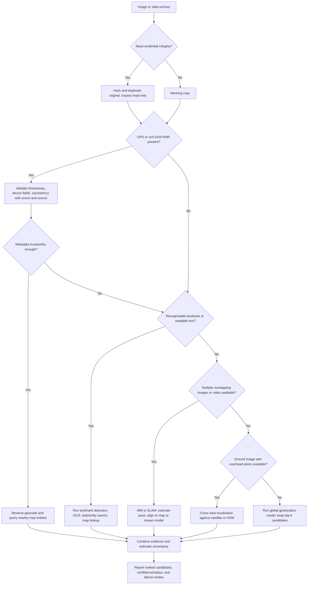

# Extracting Location-Based Data from Images

## Executive summary

Extracting location from an image is not one problem but a stack of related problems. At the simplest end, the file may already contain coordinates in EXIF or XMP metadata. At the hardest end, there may be no metadata at all, forcing localisation from visual evidence such as landmarks, road signs, vegetation, architecture, skylines, shadows, or geometric relations across multiple images. Between those extremes sit photogrammetry, structure-from-motion, visual place recognition, visual localisation, SLAM, cross-view matching against aerial or satellite imagery, and newer multimodal systems that combine images with maps, text, OCR, GPS priors, or language-model reasoning. The most reliable pipeline is therefore usually **metadata-first, geometry-second, semantics-third, reasoning-last**, with explicit uncertainty at every stage. citeturn15search7turn33view3turn34view0turn31search5turn20view0turn45view1

Three practical findings stand out from the literature and tooling. First, **metadata can be exact but is fragile**: Exif is a standard and tools such as ExifTool can read and write it easily, which is useful operationally but means metadata is not automatically trustworthy evidence. Second, **single-image worldwide geolocation has improved a great deal but is still coarse and unevenly distributed**: models such as PlaNet, hierarchical scene-aware models, TransLocator, StreetCLIP and GeoCLIP improve benchmark accuracy, but even strong systems still struggle with street-level precision on unconstrained images, especially in underrepresented regions. Third, **local geometric methods can be very accurate when a mapped scene exists**: SfM, visual localisation and SLAM can deliver centimetre- to metre-level pose estimates in bounded environments, but they depend on overlap, a reference map or model, and significantly more compute and operational setup than metadata extraction or landmark APIs. citeturn18view2turn19view3turn36search1turn17search7turn18view1turn17search16turn31search5turn31search0turn20view0

For rigorous work, especially forensics or OSINT, the right question is not “What is the location?” but “What is the **best-supported set of candidate locations**, from which signals, with what confidence, and what assumptions could break the conclusion?” Retrieval-based approaches naturally support ranked candidate lists and kernel-density posteriors; classification models yield cell probabilities; landmark APIs return confidence and coordinates; SfM and visual localisation provide inlier counts, reprojection behaviour and pose error metrics. The safest reporting format is a **ranked shortlist plus radius/pose thresholds**, not a single dot on a map. citeturn19view3turn16search1turn44view1turn20view0turn42view0turn42view1

## Foundations and taxonomy

In plain terms, **EXIF and related metadata** are facts stored inside the file, such as camera make, timestamp, and sometimes GPS coordinates. **Visual geolocation** tries to infer where a photo was taken from the pixels alone. **Photogrammetry** is the broader discipline of measuring from photographs; in modern CV, **structure-from-motion** estimates camera poses and a sparse 3D scene from overlapping images, while multi-view stereo densifies the reconstruction. **SLAM** does something similar online, estimating a camera trajectory while building or updating a map in real time. **Landmark recognition** identifies known places; **scene classification** labels broad environmental types such as urban, indoor or natural; **contextual inference** uses weak but informative clues such as script, road furniture, mountain skylines, sun angle or cultural artefacts; and **multi-image / multi-modal methods** combine several photos, video, text, maps, satellite data, OCR or user history to reduce ambiguity. citeturn15search7turn34view0turn31search5turn31search20turn31search0turn36search7turn38search0turn37search13

A useful way to separate these families is by the **type of prior knowledge** they assume. Metadata methods assume the answer may already be embedded in the file. Landmark and global geolocation models assume access to large corpora of geotagged reference images. Cross-view methods assume a georeferenced overhead database such as satellite tiles or map layers. SfM and photogrammetry assume multiple overlapping views of the same scene. SLAM assumes a temporal stream and often a revisitable environment. Multimodal reasoning assumes that location can be narrowed by combining visual cues with external structured knowledge such as maps, OCR, text descriptions, climate or geographic hierarchies. This is why “best method” is usually the wrong framing: method choice should follow the information actually available. citeturn18view2turn19view3turn38search0turn31search5turn31search0turn37search7turn41view0

The table below compares the main method families. Unless a cited source explicitly reports hardware, compute is marked as **unspecified** and should be treated as implementation- and dataset-dependent.

| Method family | What it uses | Strengths | Weaknesses | Typical performance | Compute | Best fit | Primary references |
|---|---|---|---|---|---|---|---|
| EXIF / XMP / file metadata | Embedded tags, timestamps, GPS, device info | Potentially exact, cheap, immediate | May be absent, stripped, inconsistent or editable | Exact coordinates when authentic GPS tags are present; zero benefit when absent | Low | Triage, forensics, ingestion pipelines | citeturn15search7turn33view3turn34view0turn14search17 |
| Landmark recognition + OCR | Known POIs, visible text, logos, signs | Very high precision when a famous place or readable sign is present | Low recall on generic scenes; long-tail coverage is poor | Often excellent on popular landmarks; unreliable on ordinary streets or rural scenes | Low to medium | Tourism photos, monuments, signage-rich urban scenes | citeturn44view0turn44view1turn24view2 |
| Worldwide single-image geolocation | Global geotagged image corpora; scene priors | Works without explicit metadata; broad coverage | Usually coarse, dataset-biased, hard to calibrate | On IM2GPS3K, published models range from 24.8% to 31.1% within 25 km for PlaNet and TransLocator; ISNs reports 9.7% within 1 km and 27.0% within 25 km; StreetCLIP zero-shot reports 22.4% within 25 km and 37.4% within 200 km | Training often high; inference moderate | OSINT, archival geotagging, broad candidate generation | citeturn18view2turn36search1turn17search7turn18view1turn45view0 |
| Cross-view ground-to-satellite / map matching | Street view matched to satellite or map priors | Strong when overhead reference data exists; can estimate heading as well as position | Large viewpoint gap; benchmark-specific; dense priors needed | Often evaluated via retrieval/recall or 3-DoF localisation rather than kilometre error | Medium to high | Robotics, UAVs, GNSS-denied navigation | citeturn6search6turn38search9turn37search13 |
| Photogrammetry / SfM | Multiple overlapping views and geometry | Produces measurable 3D structure and camera poses; supports high-accuracy site reconstruction | Needs overlap, texture and multiple images; not a global method by itself | High local accuracy; dominant general-purpose reconstruction pipeline in practice | Medium to high | Archaeology, forensics, surveying, site modelling | citeturn31search5turn31search20turn43search0turn43search3 |
| SLAM / visual localisation | Sequences, revisits, mapped reference scenes | Real-time or near-real-time pose tracking; excellent local pose estimation | Needs a map or repeated environment; sensitive to lighting and appearance change | ORB-SLAM3 reports 3.6 cm on EuRoC and 9 mm on TUM-VI in cited settings; long-term localisation benchmarks show changing conditions remain hard | Medium to high | AR/VR, robotics, vehicles | citeturn31search0turn20view0turn20view1 |
| NeRF-based relocalisation | Learned radiance field of a mapped scene | Strong local pose refinement and view synthesis-based checking | Usually local rather than global; training and optimisation cost can be high | Promising for local relocalisation; recent work reports strong pose refinement but with higher cost | High | Precision relocalisation in bounded scenes | citeturn30search19turn30search0turn30search16 |
| Multi-image / multi-modal reasoning | Albums, video, OCR, text, maps, satellite, climate priors | Reduces ambiguity; often most practical in real investigations | Harder pipelines, more moving parts, calibration challenges | PlaNet’s album/LSTM extension reported 50% improvement over its single-image model; recent text-guided cross-view work reports +10% recall | Medium to high | Social media analysis, emergency response, analyst-in-the-loop workflows | citeturn18view2turn37search7turn37search2 |

## Algorithms and models

Classical computer vision still matters because much of image localisation reduces to **finding correspondences and fitting geometry robustly**. SIFT extracts scale- and rotation-invariant local features and was designed for reliable matching across viewpoint and illumination changes. ORB is a much faster binary alternative, reported by its authors as around two orders of magnitude faster than SIFT while remaining effective in many settings. Robust estimation is then usually handled by RANSAC, and camera pose from 2D–3D matches is commonly solved by PnP methods such as EPnP, whose computational complexity grows linearly with the number of correspondences. In practice, this classical stack remains the backbone of many pose estimation, retrieval verification and SfM systems. citeturn39search4turn39search9turn39search7turn39search10turn33view2

The modern deep-learning stack improves on both **representation learning** and **matching quality**. SuperPoint learns interest points and descriptors jointly; SuperGlue matches sparse features using attention and differentiable optimal transport; LoFTR goes further by performing detector-free matching with transformers and reports strong results on indoor and outdoor datasets, including first place on two public visual localisation benchmarks among published methods; and GIM addresses a major practical problem, namely poor cross-domain generalisation, by self-training matchers on internet video. The consequence is straightforward: if the task is geometric alignment under wide baselines or low-texture regions, learned matchers are often a better default than hand-crafted feature pairs, provided compute is available. citeturn40search0turn40search5turn40search10turn40search7

For **worldwide single-image geolocation**, the major design choices are classification, retrieval, or hybrid schemes. PlaNet reframed geolocation as classification over adaptive geographic cells and reported large gains over earlier approaches; it also improved photo-album localisation by combining the single-image model with an LSTM, yielding a reported 50% improvement. Revisiting IM2GPS in the deep-learning era then showed that even when the end task is retrieval, features learned with classification loss can outperform metric-learning baselines, and that kernel density estimation over neighbour coordinates is a simple but strong way to turn image retrieval into a geographic posterior. Hierarchical models added scene classification and geographic hierarchies, while transformer-era models such as TransLocator and query-based hierarchical decoders added stronger global context and multi-task reasoning. citeturn18view2turn19view3turn36search1turn17search7turn16search1

Transformer and CLIP-style models are especially important because they change the representation from “classify into one fixed cell” toward “align images with places in a shared embedding space”. StreetCLIP uses a CLIP ViT base and a synthetic-caption pretraining scheme for open-domain zero-shot geolocation; its model card reports that it was trained for three epochs on 3 NVIDIA A100 80 GB GPUs and that, in zero-shot evaluation, it reaches 28.3% within 25 km on IM2GPS and 22.4% within 25 km on IM2GPS3K while outperforming its own CLIP baseline on those benchmarks. GeoCLIP, in turn, aligns images with continuous GPS representations rather than a fixed cell taxonomy and reports state-of-the-art results on several benchmarks in its official implementation. These models are attractive when you want a reusable encoder and broad transfer, but they remain benchmark-sensitive and not yet uniformly calibrated. citeturn18view1turn18view0turn17search16

Cross-view geolocation is a partially different problem. Instead of asking “which Earth cell generated this image?”, it asks whether a ground image can be matched to aerial or satellite reference data. Transformer-based TransGeo showed that a transformer architecture could be highly effective for cross-view retrieval, and later work added semantics, heading estimation, birds-eye-view transforms and text-guided retrieval over satellite or OSM references. This family is particularly strong for robotics and navigation because the target search space can be bounded by maps, road networks or vehicle motion, but it is much less useful for completely open-world one-off photographs unless strong priors already exist. citeturn6search6turn38search9turn37search7turn37search13

Geometry-heavy methods occupy the other end of the spectrum. **SfM pipelines** such as COLMAP incrementally recover camera poses and sparse points, then optionally densify with MVS. This is excellent for reconstructing a site or building a long-lived reference model. **Visual localisation** methods then solve for the 6-DoF pose of a new image against that 3D reference. **SLAM** systems such as ORB-SLAM3 do this online, using place recognition and bundle adjustment to remain accurate in both small and large environments. These are the methods to choose when you care about pose, not merely region or country, but they need a mapped environment and enough shared visual structure. citeturn31search5turn31search20turn20view0turn31search0

Neural radiance fields are best understood as **scene representations that make new viewpoints renderable**, which makes them useful for checking whether a hypothesised pose is visually consistent with the scene. The original NeRF paper focused on high-fidelity novel view synthesis rather than localisation. More recent localisation papers use conditional or point-based NeRF variants to combine classical matching with rendering-based pose refinement. The practical takeaway is that NeRF is valuable for **local relocalisation and verification** in mapped scenes, but it is not currently the default answer to global image geolocation. citeturn30search19turn30search0turn30search16

## Data sources, priors, and software ecosystems

The quality of any localisation method is bounded by the quality of its priors. For global learning-based geolocation, **YFCC100M** remains foundational because it provides 100 million Creative-Commons Flickr media objects with rich metadata including camera, title, tags and geo. **Google Landmarks Dataset v2** is a much more targeted landmark benchmark with over 5 million images, 200,000 instance labels and a 118,000-image test set. **GL3D** is a geometry-oriented resource with 125,623 high-resolution images over 543 scenes, plus SfM-derived camera parameters, SIFT keypoints, depth maps and overlap labels. **Mapillary Street-Level Sequences** contributes sequence-based place recognition at scale with more than 1.6 million images, while **OpenStreetView-5M** extends open-access global street-view coverage to over 5.1 million geo-referenced images across 225 countries and territories with a 1 km train/test spatial separation specifically designed to reduce memorisation. citeturn24view0turn24view1turn24view2turn23view0turn29search0turn41view0

For **semantic and contextual priors**, datasets such as Mapillary Vistas matter because they do not primarily label “place”, they label the scene contents that make a place recognisable. The Vistas paper introduced 25,000 high-resolution street-level images annotated into 66 object categories with instance labels for 37 classes. That kind of dense scene supervision is why scene-aware geolocation models can reason about urban form, road infrastructure and environmental context rather than just memorising exemplars of famous places. This is particularly useful for contextual inference and model interpretability. citeturn29search1turn29search6turn38search4turn36search1

For **maps and geospatial context**, OpenStreetMap is operationally important because it is queryable rather than just viewable. Overpass is a database engine for querying OSM data, and Nominatim is the geocoder behind the official OSM site, serving tens of millions of queries per day according to its project page. These are ideal for turning a coarse image prediction into concrete nearby candidates: road classes, POIs, tourism tags, building footprints, language clues, or nearby landmarks. But they also bring usage and licensing constraints: the OSM Foundation’s standard raster tile service has an explicit usage policy and is not a free bulk background layer for arbitrary production workloads. citeturn25view0turn25view1turn11search2

For **satellite priors**, Sentinel-2 and Landsat are the most defensible default sources in many research and public-interest settings because they are official, broad-coverage and open. Sentinel-2 provides 13 spectral bands, a 290 km swath and roughly a five-day revisit at the Equator, with data made available systematically and free of charge. Landsat provides a continuous multispectral archive dating back to 1972, and USGS states Landsat products in the EROS archive are available for download at no cost. These are ideal for cross-view retrieval, land-cover priors, seasonal context and validation against claimed terrain characteristics, though their spatial resolution is well below typical street-level imagery. citeturn26view2turn10search3turn10search14

The software landscape is mature. **ExifTool** is the workhorse for metadata inspection and editing. **OpenCV** covers feature detection, matching, homography, calibration and pose estimation. **COLMAP** is the general-purpose SfM/MVS default for many labs, with GUI and CLI workflows; **PyCOLMAP** exposes much of that functionality to Python and offers CUDA wheels on Linux for supported builds. **OpenSfM** is a scalable Python SfM pipeline that explicitly integrates external sensor measurements such as GPS and accelerometer data. **AliceVision** and **Meshroom** provide photogrammetric reconstruction and camera tracking in a more production-oriented, visually accessible workflow, with Meshroom built on AliceVision and GPU acceleration for several expensive steps. **PyTorch** dominates current research implementations, with TensorFlow/Keras still fully capable for data pipelines and serving. **Google Cloud Vision** provides landmark detection, OCR and web-image signals, while Google’s Street View Static API can supply street-level reference imagery if you accept API keys, billing and regional terms. citeturn33view3turn33view2turn43search4turn43search0turn43search2turn43search3turn31search3turn31search6turn31search21turn32search0turn32search5turn44view0turn44view1turn25view2

## Evaluation, datasets, and practical pipelines

Two evaluation traditions dominate. For **open-world image geolocation**, the standard metric is the fraction of test images whose predicted coordinates fall within fixed geodesic thresholds, usually 1 km, 25 km, 200 km, 750 km and 2,500 km, corresponding roughly to street, city, region, country and continent levels. For **visual place recognition**, recall@N is common, often with a positive-match distance threshold; the Deep Visual Geo-Localization Benchmark tooling defaults to recalls at 1, 5, 10 and 20 and exposes a positive-distance threshold parameter. For **visual localisation**, pose evaluation uses both translation and orientation accuracy against a reference scene model. These metrics are not interchangeable, so published numbers should only be compared within the same task family. citeturn16search4turn42view0turn42view1turn20view0

Representative benchmark results show both progress and remaining difficulty. From the StreetCLIP model card, PlaNet scores 24.5/37.6/53.6/71.3 on IM2GPS at 25/200/750/2,500 km, while TransLocator reaches 48.1/64.6/75.6/86.7 and StreetCLIP zero-shot reaches 28.3/45.1/74.7/88.2 on the same thresholds. On IM2GPS3K, the same card lists PlaNet at 24.8/34.3/48.4/64.6, ISNs at 28.0/36.6/49.7/66.0, TransLocator at 31.1/46.7/58.9/80.1, and StreetCLIP zero-shot at 22.4/37.4/61.3/80.4. A separate 2024 bias study reports ISNs at 9.7% within 1 km and 27.0% within 25 km on IM2GPS3K, but only 1.0% within 1 km and 6.0% within 25 km on a 100-image African benchmark, which is a concrete warning against over-reading leaderboard numbers from geographically skewed datasets. citeturn18view1turn17search7turn45view0

Datasets should be chosen by task, not popularity. Use **IM2GPS / IM2GPS3K** to compare open-world photo geolocation with historical literature. Use **YFCC100M** when you need scale and rich social-image metadata. Use **GL3D** when you need supervised geometry, correspondences or local-feature training. Use **GLDv2** and commercial landmark APIs when landmarks dominate the workload. Use **MSLS** or **OSV-5M** for place recognition and globally distributed street-view geolocation. Use **visuallocalization.net** datasets such as Aachen Day-Night, CMU-Seasons or RobotCar-Seasons if the output must be a camera pose in a mapped environment rather than just a latitude/longitude guess. citeturn24view0turn23view0turn24view2turn29search0turn41view0turn20view0turn20view1

A practical decision flow is below. It reflects the most evidence-preserving order of operations: inspect without altering, exploit hard signals first, then move from semantic matching to geometry, and only then rely on broad geolocation models or language-model-style reasoning. citeturn33view3turn34view0turn44view0turn20view0turn31search20turn45view1



A minimal **metadata-first** shell workflow is usually the right starting point:

```bash
# Inspect all visible and unknown tags
exiftool -G1 -a -u -json image.jpg

# Focus on time and GPS-related fields
exiftool -time:all -gps:all image.jpg

# Geotag images from a GPX or other track log
exiftool -geotag track.gpx photos/

# If privacy protection is required on a copy, remove metadata
exiftool -all= -overwrite_original copy.jpg
```

These commands follow the official ExifTool documentation and geotagging guide: ExifTool reads and writes metadata across many formats, preserves originals by default with an `_original` suffix, and supports track-based geotagging via `Geotag`, `Geosync` and `Geotime`. citeturn33view3turn34view0

A minimal **classical visual matching** skeleton in Python can be used to test whether a query image matches a georeferenced reference image or map render:

```python
import cv2
import numpy as np

query = cv2.imread("query.jpg", cv2.IMREAD_GRAYSCALE)
ref   = cv2.imread("reference.jpg", cv2.IMREAD_GRAYSCALE)

sift = cv2.SIFT_create()
kq, dq = sift.detectAndCompute(query, None)
kr, dr = sift.detectAndCompute(ref, None)

matcher = cv2.BFMatcher()
raw = matcher.knnMatch(dq, dr, k=2)
good = [m for m, n in raw if m.distance < 0.75 * n.distance]

if len(good) >= 12:
    qpts = np.float32([kq[m.queryIdx].pt for m in good])
    rpts = np.float32([kr[m.trainIdx].pt for m in good])
    H, inliers = cv2.findHomography(qpts, rpts, cv2.RANSAC, 3.0)
    print(f"Matches: {len(good)}, inliers: {int(inliers.sum())}")
else:
    print("Insufficient evidence for geometric verification.")
```

This is only the first stage. For camera pose you would replace planar homography with 2D–3D correspondences and `solvePnPRansac`, or pass the data into an SfM/localisation stack. The underlying ingredients—SIFT/ORB features, feature matching, homography and pose estimation—are standard OpenCV and classical localisation components. citeturn33view2turn39search4turn39search9turn39search10turn39search7

A compact **SfM reconstruction** workflow with COLMAP typically looks like this:

```bash
colmap feature_extractor --database_path database.db --image_path images
colmap exhaustive_matcher --database_path database.db
mkdir -p sparse
colmap mapper --database_path database.db --image_path images --output_path sparse
colmap image_undistorter --image_path images --input_path sparse/0 --output_path dense
colmap patch_match_stereo --workspace_path dense
colmap stereo_fusion --workspace_path dense --output_path dense/fused.ply
```

If speed and defaults matter more than fine control, COLMAP’s `automatic_reconstructor` is the official one-command entry point, and OpenSfM’s `reconstruct` command plays a similar role in a Python-based pipeline. citeturn43search0turn43search1turn43search3

Finally, once you have a coordinate hypothesis, use a map query layer. An Overpass query around a candidate point can pull nearby POIs, road classes or tourism objects; Nominatim can reverse-geocode it; and a landmark or OCR result from Google Vision can be intersected with those nearby entities. This is often where coarse image predictions become usable analyst leads. citeturn25view0turn25view1turn44view0turn44view1

## Limitations, uncertainty, adversarial issues, and governance

The most important failure mode is **false certainty**. Metadata may exist but be stale, copied, rewritten or stripped. ExifTool itself documents both read and write operations in detail, which is exactly what makes it valuable in practice and exactly why EXIF alone does not prove provenance. Forensic value therefore comes from agreement across signals: metadata, scene content, source chain, map consistency, timestamps, shadows, and, where possible, independent corroboration. NIST’s digital image management guidance also emphasises preserving originals and clearly distinguishing processed outputs from originals. citeturn33view3turn34view0turn14search0turn14search17

A second major limitation is **dataset and geographic bias**. The 2024 regional-bias study found that a state-of-the-art model over-predicted high-income Western countries and that performance degraded sharply on African images relative to IM2GPS3K. The same paper points directly to imbalanced training data and the overrepresentation of landmarks and attractive tourist locations. OpenStreetView-5M was built partly in response to related concerns, explicitly enforcing spatial train/test separation and curating broad global coverage. Even so, representativeness remains an open problem, especially in rural areas and the Global South. citeturn45view0turn41view0

A third limitation is **scene ambiguity**. Ordinary roads, beaches, forests, mountain valleys, modern suburbs and indoor scenes are often geographically non-unique. Long-term visual localisation benchmarks were created precisely because seasonal, illumination and weather shifts still break methods that look strong on static benchmarks. In cross-view systems the viewpoint gap is itself a source of ambiguity, while in SfM and SLAM low texture, repeated facades and dynamic objects reduce match reliability. The right operational response is to abstain more often, keep multiple candidates, and expose uncertainty rather than suppress it. citeturn20view0turn20view1turn38search0turn31search5

On uncertainty, the literature suggests practical proxies rather than a single universal standard. Retrieval systems can use neighbour dispersion or kernel-density concentration; classification systems can report top-k cell probabilities rather than only argmax; landmark APIs expose confidence and location candidates; and geometry pipelines can report inlier counts, reprojection quality and pose thresholds. In reports, express uncertainty geographically—as a candidate list, radius, or pose tolerance—not just numerically. citeturn19view3turn44view1turn42view0turn20view0

Privacy and ethics are not side issues here. The UK ICO states that **personal data** includes information relating to an identifiable person, explicitly including **location data**, and defines geolocation data as data from a user’s device indicating geographical location, including GPS and local Wi‑Fi information. Apple documents how to review and remove location metadata from photos, and Mapillary states that uploaded imagery is automatically processed to blur faces and licence plates. At the same time, recent work on large vision-language models shows that images can be geolocated accurately even **without explicit geographic training or embedded geotags**, which materially increases privacy risk for publicly shared images. citeturn12search12turn12search8turn12search19turn12search14turn45view1

Legal and operational constraints also come from the data sources themselves. Google’s Street View Static API requires a Google Cloud project, billing and an API key, and charges per request. The OSM Foundation’s standard raster tile service is governed by its own usage policy. In short: having a technically feasible pipeline does not mean the underlying imagery or tiles are legally or economically free to use at production scale. citeturn25view2turn11search2

## Applications, further reading, and open research challenges

In **forensics**, metadata extraction is often the starting point, but not the end point. EXIF can contain timestamps, device identifiers and geolocation, and recent forensic studies continue to examine how messaging platforms and transfer workflows preserve or destroy that information. Best practice is to preserve originals, hash files, document every write operation, and treat metadata as one evidential strand among several. citeturn14search10turn14search17turn14search0turn33view3

In **archaeology and heritage**, photogrammetry and SfM are already mainstream because they turn ordinary overlapping photographs into measurable 3D records of buildings, small finds and landscapes. Comparative archaeological studies and practitioner reports show these workflows being used to record standing buildings, produce DEMs and share textured 3D models with both researchers and the public. Here the “location” task is often not global geolocation but precise spatial reconstruction within a site. citeturn13search5turn13search13turn31search5

In **navigation, AR/VR and robotics**, the dominant problem is camera pose, not country prediction. The Long-term Visual Localization benchmark was built around 6-DoF pose estimation under illumination and seasonal change, and ORB-SLAM3 represents the current open-source baseline for real-time visual and visual-inertial SLAM across monocular, stereo and RGB-D settings. When a mapped environment exists, these methods are far more precise than global geolocation models. citeturn20view0turn20view1turn31search0

In **social media analysis and disaster response**, multimodal pipelines are especially valuable because many posts lack reliable geotags. Recent work shows that combining text from posts with text extracted from images improves location prediction during disasters, reinforcing a general lesson: in the wild, the highest-value systems are usually not “image-only” even when the entry point is an image. citeturn37search2turn37search9

Suggested further reading, prioritising primary or official sources:

- Hays and Efros, **Im2GPS** for the original open-world framing of image geolocation. citeturn2search1
- Weyand et al., **PlaNet** for adaptive geocell classification and album-level extension. citeturn18view2
- Vo, Jacobs and Hays, **Revisiting IM2GPS in the Deep Learning Era** for retrieval plus kernel-density posteriors. citeturn19view3
- Müller-Budack et al., **Geolocation Estimation of Photos using a Hierarchical Model and Scene Classification** for scene-aware global models. citeturn36search7turn36search1
- Pramanick et al., **TransLocator** and Clark et al., **query-based hierarchical transformer geolocation** for transformer-era worldwide models. citeturn17search7turn16search1
- StreetCLIP and GeoCLIP for CLIP-style and continuous-location representations. citeturn18view1turn17search16turn18view0
- Schönberger and Frahm, **Structure-from-Motion Revisited**, plus the official COLMAP docs for practical reconstruction. citeturn31search5turn43search1turn43search0
- Campos et al., **ORB-SLAM3**, for modern open-source SLAM. citeturn31search0
- Tancik et al., **NeRF**, plus PNeRFLoc / conditional NeRF localisation papers, for rendering-based relocalisation. citeturn30search19turn30search16turn30search0
- YFCC100M, GLDv2, GL3D, MSLS and OSV-5M for data selection according to task. citeturn24view0turn24view2turn23view0turn29search0turn41view0

Open questions and research challenges:

- **Representativeness and fairness.** Current training sets still overrepresent some regions and underrepresent others, which directly changes model outputs and benchmark rankings. citeturn45view0turn41view0
- **Calibrated uncertainty and abstention.** Too many systems still optimise top-1 accuracy rather than well-calibrated posteriors or explicit “I do not know” behaviour. citeturn19view3turn42view0
- **Robustness to tampering and synthetic media.** Metadata is editable, scenes can be staged, and LVLMs can infer location from surprisingly weak cues, raising both attack and privacy concerns. citeturn33view3turn45view1
- **Better multimodal integration.** The next generation of systems is likely to merge image retrieval, OCR, maps, satellite data, language reasoning and geometry in a single probabilistic pipeline rather than choosing one family alone. citeturn37search7turn37search2turn38search0
- **Local-to-global continuity.** Bridging coarse worldwide geolocation with high-precision local pose estimation remains operationally awkward; many real systems still require separate retrieval and geometric refinement stages. citeturn20view0turn31search5turn43search0

Overall, the field is mature enough that a good engineer or analyst should think in **layers of evidence** rather than in single models. If metadata is present and trustworthy, use it. If a landmark is visible, verify it. If multiple views exist, reconstruct geometry. If maps or satellite priors exist, exploit cross-view matching. If none of those are available, then worldwide geolocation models and multimodal reasoning become your candidate generators—not your final authority. citeturn33view3turn44view0turn31search5turn20view0turn18view1turn45view1